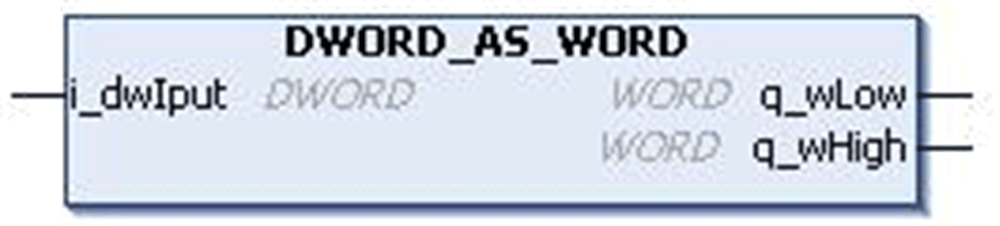

# `DWORD_AS_WORD` Function Block

## Pin Diagram

This figure shows the pin diagram of the `DWORD_AS_WORD` function block:

## Functional Description

The `DWORD_AS_WORD` function block converts an input value of data type `DWORD` to lower and higher outputs of type `WORD`.

The input double word `i_dwIput` is split into two words, higher `q_wHigh` and lower `q_wLow` words.

## Input Pin Description

This table describes the input pins of the `DWORD_AS_WORD` function block:

| Input | Data Type | Description |
| --- | --- | --- |
| `i_dwIput` | `DWORD` | Input value  Range: 0...4294967295 |

## Output Pin Description

This table describes the output pins of the `DWORD_AS_WORD` function block:

| Output | Data Type | Description |
| --- | --- | --- |
| `q_wLow` | `WORD` | Lower word output value  Range: 0...65535 |
| `q_wHigh` | `WORD` | Higher word output value  Range: 0...65535 |

EIO0000000096.09