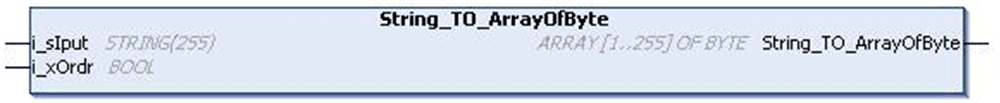
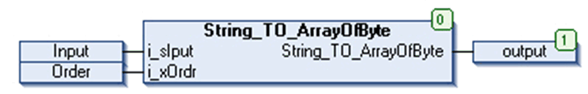

# `String_TO_ArrayOfByte` Function

## Pin Diagram

This figure shows the pin diagram of the `String_TO_ArrayOfByte` function:

## Functional Description

The `String_TO_ArrayOfByte` function is an output Array [255] of bytes is the ASCII value of the input String.

If the Order input is TRUE, then the order of the output values corresponds to the order of the string characters at the input. This means there is a 1:1 correspondence between the order of inputs and the order of ASCII value returned at the output as explained in example 1.

If the Order input is False, then the output is such that the ASCII value of string character at input[1] of input array[1..255] is displayed in position 2 of the output. The ASCII value of string character at input[2] of input array[1..255] is displayed in position 1 of the output. Similarly the ASCII value of string character at input[3] of input array[1..255] is displayed in position 4 of the output and the ASCII value of string character at input[4] of input array[1..255] is displayed in position 3 of the output as explained in example 2.

## Example 1

If the Order input is TRUE then only output array is displayed in the order of string input as shown:

`i_sIput`='ABCDE'

`i_xOrdr`= TRUE

Then the string to array of byte output is:

* output [1] = 65
* output [2] = 66
* output [3] = 67
* output [4] = 68
* output [5] = 69
* output [6] = 0

As shown in the above example, Input [1] = A, its corresponding ASCII code is 65, displayed in output [1] position.

Similarly input [2] = B, its corresponding ASCII code is 66, displayed in output [2] position and so on.

## Example 2

`i_sIput`='ABCDE'

`i_xOrdr`= FALSE

Then the string to array of byte output is:

* output [1] = 66
* output [2] = 65
* output [3] = 68
* output [4] = 67
* output [6] = 0
* output [5] = 69

As shown in the above example,

Input [1] = A, its corresponding ASCII code is 65, displayed in output [2] position.

Input[2] = B, and its corresponding ASCII code is 66, displayed in output [1] position.

Similarly input [3] = C, its corresponding ASCII code is 67, displayed in output [4] position.

Input [4] = D, its corresponding ASCII code is 68, displayed in output [3] position.

Similarly Input [5] = E, its corresponding ASCII code is 69, displayed in output [6] position.

Input [6] = (space), its corresponding ASCII code is “ “ (that is one blank space character) is displayed in output [5] position.

NOTE: However if the number of bytes at the input is 255, Order input is FALSE. Then the last ASCII value remains in the same position (refer example 3 below).

Input:

* `i_sIput` [1...250]='A'
* `i_sIput` [251...255]='BCDEF'

Order: FALSE

Output

* Output [1...250]:='65'
* Output [251...255]='CBEDF'

## Input Pin Description

This table describes the input pins of the `String_TO_ArrayOfByte` function:

| Input | Data Type | Description |
| --- | --- | --- |
| `i_sIput` | `STRING [1...255`] | Input string value (1...255) |
| `i_xOrdr` | `BOOL` | TRUE: Output in order of input  FALSE: Output swaps higher and lower byte. |

NOTE: It is mandatory for the user to define the size of the string input[255], else the size is taken as 80 by default.

## Output Pin Description

This table describes the output pins of the `String_TO_ArrayOfByte` function:

| Output | Data Type | Description |
| --- | --- | --- |
| String\_TO\_Array OfByte | `ARRAY [0...255] OF BYTE` | Array of ASCII values  Range: 0...255 |

## Instantiation and Usage Example

This figure shows an instance of the the `String_TO_ArrayOfByte` function:

## With Order Input

`i_sIput` [255]:

* Input [1] = A
* Input [2] = B
* Input [3] = C
* Input [4] = D
* Input [5] = E

`i_xOrdr`: TRUE

The `String_TO_ArrayOfByte` displays '65, 66, 67, 68, 69'

## Without Order Input

`i_sIput` [255]:

* Input [1] = A
* Input [2] = B
* Input [3] = C
* Input [4] = D
* Input [5] = E

`i_xOrdr`: FALSE

The `String_TO_ArrayOfByte` displays '66, 65, 68, 67, 69'

EIO0000000096.09