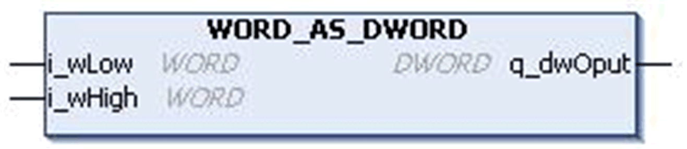

# `WORD_AS_DWORD` Function Block

## Pin Diagram

This figure shows the pin diagram of the `WORD_AS_DWORD` function block:

## Functional Description

The `WORD_AS_DWORD` function block merges two input values of data type `WORD` into a single output of type `DWORD`.

The higher word input `i_wHigh` is shifted to the left by 4 nibbles and adds the lower word input `i_wLow` to obtain a Dword output `q_dwOput`.

## Input Pin Description

This table describes the input pins of the `WORD_AS_DWORD` function block:

| Input | Data Type | Description |
| --- | --- | --- |
| `i_wLow` | `WORD` | Lower word input value  Range: 0...65535 |
| `i_wHigh` | `WORD` | Higher word input value  Range: 0...65535 |

## Output Pin Description

This table describes the output pins of the `WORD_AS_DWORD` function block:

| Output | Data Type | Description |
| --- | --- | --- |
| `q_dwOput` | `DWORD` | Output Dword value  Range: 0...4294967295 |

EIO0000000096.09