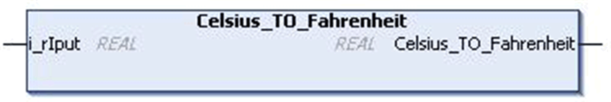

# `Celsius_TO_Fahrenheit` Function

## Pin Diagram

This figure shows the pin diagram of the `Celsius_TO_Fahrenheit` function:

## Functional Description

The `Celsius_TO_Fahrenheit` function converts temperature in Celsius to Fahrenheit.

Use `Fahrenheit_TO_Celsius` for the reverse process.

Formula: T\_Fahrenheit = [(T\_Celcius \* 1.8) + 32]

## Input Pin Description

This table describes the input pins of the `Celsius_TO_Fahrenheit` function:

| Input | Data Type | Description |
| --- | --- | --- |
| `i_rIput` | `REAL` | Input value in Celsius  Range: ±1.89e38 (higher values result INFINITY at the output). |

## Output Pin Description

This table describes the output pins of the `Celsius_TO_Fahrenheit` function:

| Output | Data Type | Description |
| --- | --- | --- |
| `Celsius_TO_Fahrenheit` | `REAL` | Output value in Fahrenheit |

EIO0000000096.09