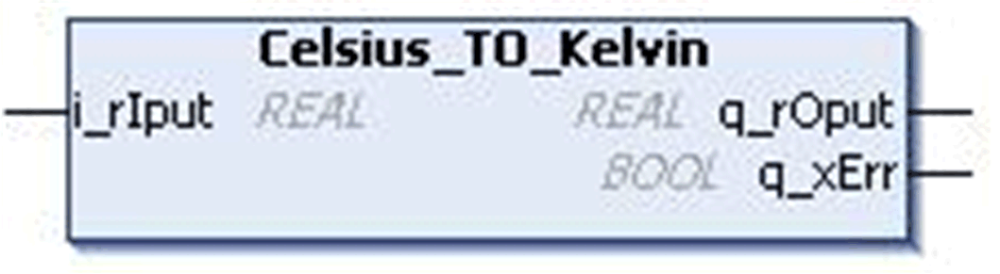

# `Celsius_TO_Kelvin` Function Block

## Pin Diagram

This figure shows the pin diagram of the `Celsius_TO_Kelvin` function block:

## Functional Description

The `Celsius_TO_Kelvin` function block converts the value of Celsius unit of `REAL` type to Kelvin unit. This result will be a `REAL` number.

The `i_rIput` pin is used to enter Celsius.

The `q_rOput` pin returns the equivalent Kelvin value in `REAL` data type.

Formula: Kelvin = Celsius + 273.15

## Input Detected Error

The `q_xErr` pin becomes TRUE if invalid Celsius value is entered in pin `i_rIput` and the pin `q_rOput` returns to 0 as the temperature in Kelvin unit cannot be less than 0.

This detected error pin is reset on valid input entry.

## Input Pin Description

This table describes the input pins of the `Celsius_TO_Kelvin` function block:

| Input | Data Type | Description |
| --- | --- | --- |
| `i_rIput` | `REAL` | Input value in Celsius  Range: -273.15...3.4e+38 |

## Output Pin Description

This table describes the output pins of the `Celsius_TO_Kelvin` function block:

| Output | Data Type | Description |
| --- | --- | --- |
| `q_xErr` | `BOOL` | TRUE: Invalid input  FALSE: Valid input |
| `q_rOput` | `REAL` | Output value in Kelvin  Range: 0...3.4e+38 |

The `i_rIput` input cannot be set to less than -273.15 because the equivalent Kelvin value is less than 0 which is theoretically not possible.

EIO0000000096.09