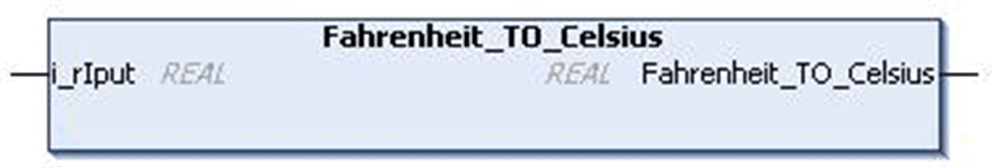

# `Fahrenheit_TO_Celsius` Function

## Pin Diagram

This figure shows the pin diagram of the `Fahrenheit_TO_Celsius` function:

## Functional Description

The `Fahrenheit_TO_Celsius` function converts temperature in Fahrenheit to Celsius.

Use `Celsius_TO_Fahrenheit` for the reverse process.

Formula: T\_Celcius = [(T\_Fahrenheit - 32) / 1.8]

## Input Pin Description

This table describes the input pins of the `Fahrenheit_TO_Celsius` function:

| Input | Data Type | Description |
| --- | --- | --- |
| `i_rIput` | `REAL` | Input value in Fahrenheit  Range: ±3.4e+38 |

## Output Pin Description

This table describes the output of the `Fahrenheit_TO_Celsius` function:

| Output | Data Type | Description |
| --- | --- | --- |
| `Fahrenheit_TO_Celcius` | `REAL` | Output value in Celsius  Range: ±1.89e+38 |

EIO0000000096.09