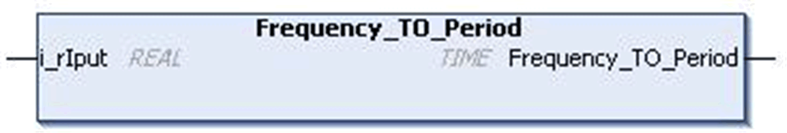

# `Frequency_TO_Period` Function

## Pin Diagram

This figure shows the pin diagram of the `Frequency_TO_Period` function:

## Functional Description

The `Frequency_TO_Period` function converts frequency (Hertz) value of type `REAL` to time. This result is of `TIME` type.

The period of time is calculated with the given frequency. The frequency is set in `i_rIput` pin in `REAL` data format. The equivalent time value is returned in `Frequency_TO_Period` pin in `TIME` data format.

Period = 1 / Frequency

NOTE: If the input is not in the previous range, the output is zero.

## Input Pin Description

This table describes the input pins of the `Frequency_TO_Period` function:

| Input | Data Type | Description |
| --- | --- | --- |
| `i_rIput` | `REAL` | Input Frequency 0.0...1000.0Hz |

## Output Pin Description

This table describes the output pins of the `Frequency_TO_Period` function:

| Output | Data Type | Description |
| --- | --- | --- |
| `Frequency_TO_Period` | `TIME` | Period of time of the frequency input. 0...4294967295 ms |

EIO0000000096.09