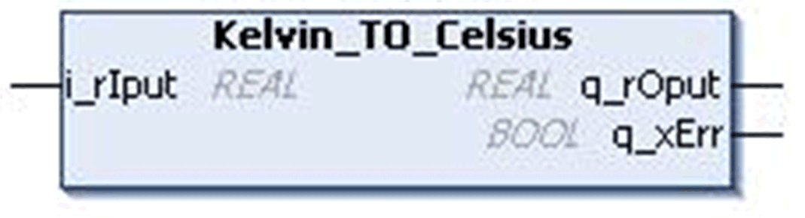

# `Kelvin_TO_Celsius` Function Block

## Pin Diagram

This figure shows the pin diagram of the `Kelvin_TO_Celsius` function block:

## Functional Description

The `Kelvin_TO_Celsius` function block converts the value in Kelvin unit of type `REAL` to Celsius unit. The result is a `REAL` number.

The pin `i_rIput` is used to enter Kelvin.

The pin `q_rOput` returns the equivalent Celsius value in `REAL` data type.

Formula: Celsius = Kelvin – 273.15

## Input Detected Error

The `q_xErr` pin of type `BOOL` becomes TRUE if the invalid Kelvin value (ie < 0) is entered in the pin `i_rIput` and the pin `q_rOput` returns –273.15, because the equivalent Celsius value for the minimum Kelvin value is –273.15.

This detected error pin is reset on valid input entry.

## Input Pin Description

This table describes the input pins of the `Kelvin_TO_Celsius` function block:

| Input | Data Type | Description |
| --- | --- | --- |
| `i_rIput` | `REAL` | Input value in Kelvin  Range: 0...3.4e+38 |

## Output Pin Description

This table describes the output pins of the `Kelvin_TO_Celsius` function block:

| Output | Data Type | Description |
| --- | --- | --- |
| `q_xErr` | `BOOL` | TRUE: Invalid input.  FALSE: Valid input. |
| `q_rOput` | `REAL` | Output value in Celsius  Range: -273.15...3.4e+38 |

## Limitations

The `i_rIput` input cannot be set to less than 0 because, theoretically Kelvin value cannot be less than 0.

EIO0000000096.09