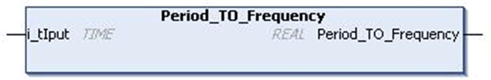

# `Period_TO_Frequency` Function

## Pin Diagram

This figure shows the pin diagram of the `Period_TO_Frequency` function:

## Functional Description

The `Period_TO_Frequency` function converts time of type `TIME` to frequency(Hertz).This result is a `REAL` number.

This function calculates the frequency of given period of time. Time is set in `i_rIput` pin in `TIME` data format. The equivalent frequency value is returned in `Period_TO_Frequency` pin in `REAL` data format.

Frequency = 1 / Period

## Input Pin Description

This table describes the input pins of the `Period_TO_Frequency` function:

| Input | Data Type | Description |
| --- | --- | --- |
| `i_tIput` | `TIME` | Input time value  Range: 0...4294967295 ms |

NOTE: If the input is not in the previous range, the output will be zero.

## Output Pin Description

This table describes the output pins of the `Period_TO_Frequency` function:

| Output | Data Type | Description |
| --- | --- | --- |
| `Period_TO_Frequency` | `REAL` | Equivalent frequency of the time input  Range: 0...1000 Hz |

EIO0000000096.09