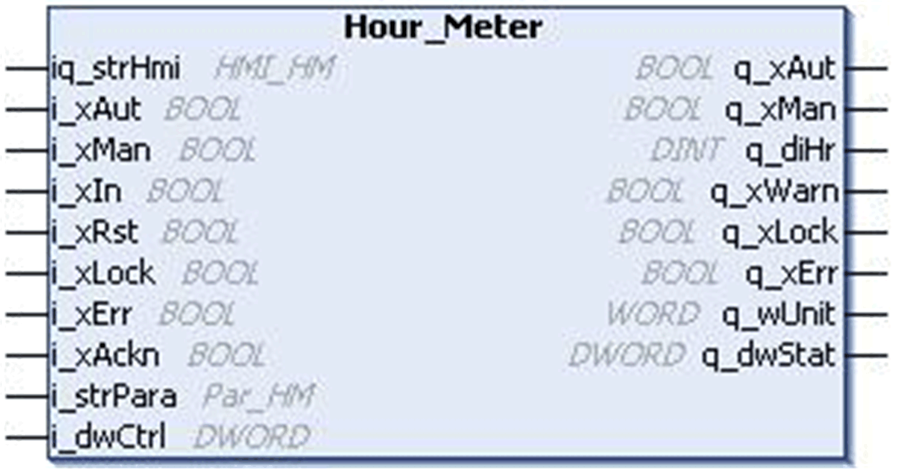

# `Hour_Meter` Function Block

## Pin Diagram

This figure shows the pin diagram of the `Hour_Meter` function block:

## Functional Description

The `Hour_Meter` function block is used for accumulating the operating hours of various devices.

## Limitations

* If an error is detected, time is not calculated for the period till the detected error is acknowledged after which time calculation resumes from the value at the arrival of detected error. Hence, if the device for which UP time is being calculated is active during the error detected state, then the accumulated time is lesser than the actual time.
* For a wrong value of time unit specified in the variable `i_strPara.wTypeTime`, the function block displays the previous value of calculated time when the time unit input is correct, but the function block does not inform the user about this erroneous condition.
* Even if the block is locked by the external Interlock input, the function block can receive, generate and display a detected error.
* In Locked mode, the function block can reset the detected error by receiving the acknowledgement input.
* The calculated time value at the output is only in seconds or minutes or hours. The user should convert it into a format like HH:MM:SS if required.
* The structure variable `i_strPara` holds the warning time value and the time unit. The user must take special precaution not to accidentally change the time units as this can result in false alarm generation.

## Operation Modes

The accumulation can take place either in manual mode or automatic mode:

* **Automatic Mode:** The automatic mode is selected through the input pin `i_xAut`. When the input `i_xIn` is set to TRUE the block accumulates the time and stops when the `i_xIn` is set to FALSE. The accumulated time is available at the output pin `q_diHr`.
* **Manual Mode:** The Manual mode is activated by the pin `i_xMan`. When the input `i_xIn` is set to TRUE the block accumulates the time and stops when the `i_xIn` is set to FALSE.The accumulated time is available at the output pin `q_diHr`. The accumulation can be inhibited by the command bit `i_dwCtrl`.

The block is de-activated on controller start and remains in the specified mode until a new one is selected. If both inputs are set to 1, then the operation mode is invalid.

## Resetting Value

The reset of the output `q_diHr` is executed by a rising edge at the input `i_xRst` in automatic mode or by a command bit in manual mode.

The reset value of the output `q_diHr` is set to the value `i_strPara.diSp` (Set Point). Additionally the detected signal `q_xWarn` is set, when the output `q_diHr` exceeds the detected error limit specified by the parameter `i_strPara.diWaitTime`.

## Setting Output Value Type

The parameter `i_strPara.wTypeTime` sets the unit of the output value. The selectable are seconds, minutes and hours. The accumulation function does not depend on this value, but is always done on the base of seconds.

## Running Conditions

The counting takes place only, if the interlock input `i_xLock` is set to FALSE. An active interlock signal inhibits the operation of the hour meter. An active interlock is indicated at the output `q_xLock`.

The function block sets the detected error signal, if the detected error input `i_xErr` is set to TRUE (external detected error) or if the operation mode is invalid (internal detected errors). The detected errors are indicated in the HMI. To reset the detected error output the detected error has to be acknowledged by a rising edge on the input `i_xAckn` or by using bit 16 of the signal `i_dwCtrl`.

EIO0000000096.09