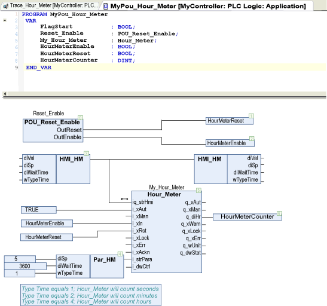
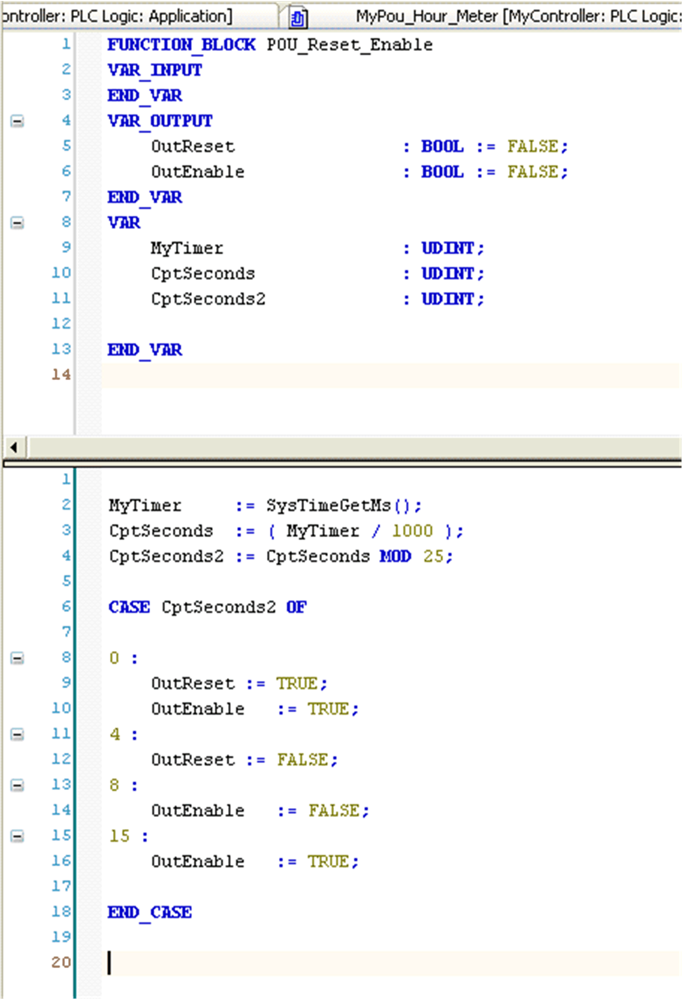
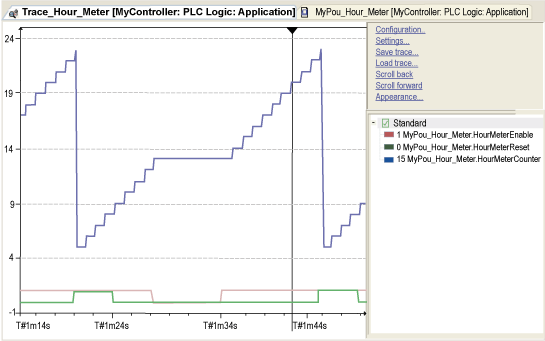

# Instantiation and Usage Example

## Instantiation and Usage Example

The following program periodically resets and enables the input of `Hour_Meter` function block:

`HourMeterReset` and `HourMeterEnable` are managed with the following POU:

Every 25 seconds, the data `HourMeterCounter` is reset with an initial value of 5. When `HourMeterReset` is FALSE, the counter holds its current value.

**Blue** `HourMeterCounter`

**Green** `HourMeterReset`

**Red** `HourMeterEnable`

In this sample, the cycle time of the POU in the MAST has no impact. For this sample, the periodicity is 100 milliseconds.

EIO0000000096.09