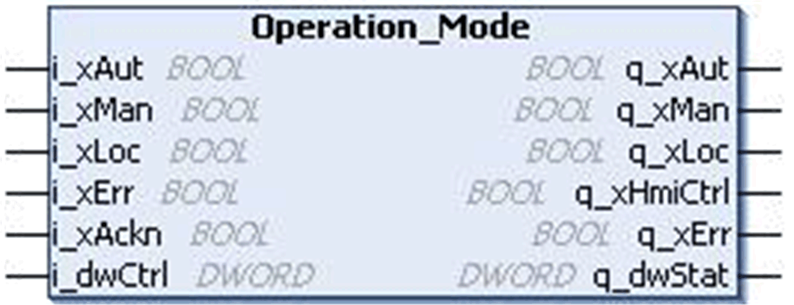

# `Operation_Mode` Function Block

## Pin Diagram

This figure shows the pin diagram of the `Operation_Mode` function block:

## Functional Description

The `Operation_Mode` function block is used for selecting between auto and manual operating modes from two different sources:

* Switches / controller program
* HMI

## Limitations

* If no operation mode is currently selected, then the previous active mode persists. For example, if auto mode with local control was set previously, then upon resetting the auto input persists till another mode is set.
* The local mode has higher priority than the HMI control. A switch in operating mode does not take place automatically when local mode is reset and HMI control is previously set along with local mode.

## Local Mode

The local mode can be activated with auto or manual mode. The local mode is activated by using the input `i_xLoc` and prohibits manual interaction from the HMI via control word input `i_dwCtrl`.

With local mode active, the operating mode can be activated by using the inputs `i_xAut` and `i_xMan`:

* If `i_xAut` is set the automatic mode is activated and indicated at the output `q_xAut`.
* If `i_xMan` is set the manual mode is activated and indicated at the output `q_xMan`.

If local mode is not active, then by setting the bits of `i_dwCtrl` the operating modes can also be activated from the HMI.

NOTE: When `q_xHmiCtrl` is set, the inputs `i_xAut` and `i_xMan` are ignored

## Priority

The `i_xLoc` has a higher priority than the `i_dwCtrl` command word. So that once the `i_xLoc` is set, the operating mode is again activated by the inputs `i_xAut` and `i_xMan`.

## Resetting a Detected Error

The block generates an invalid operation mode, if both auto and manual modes are selected (internal detected error) and displays at output `q_xErr`. It also sets the detected error signal, if the detected error input `i_xErr` is set to 1 (external detected error). Detected errors are indicated in the bits of status word `q_dwStat`. To reset the detected error output the detected error has to be acknowledged by a rising edge on the **input Ack** or by using the acknowledgement bit of the input `i_dwCtrl`.

EIO0000000096.09