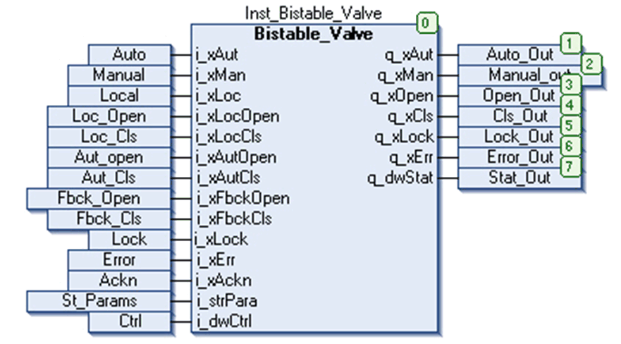

# Instantiation and Usage Example

## Instantiation and Usage Example

This figure shows an instance of the `Bistable_Valve` function block:

## Limitations

When forced enable is active (`xFrceEn`), the valve is forced in to the default position (`xPosDflt`) only for the time `iFbckDly` seconds. It is reset if an appropriate feedback signal is activated or interlock signal is removed or the `q_xErr` output is acknowledged.

Ensure that appropriate feedback signal is activated before executing the block; else an unknown position error is detected after a time delay of `iFbckDly` seconds.

EIO0000000096.09