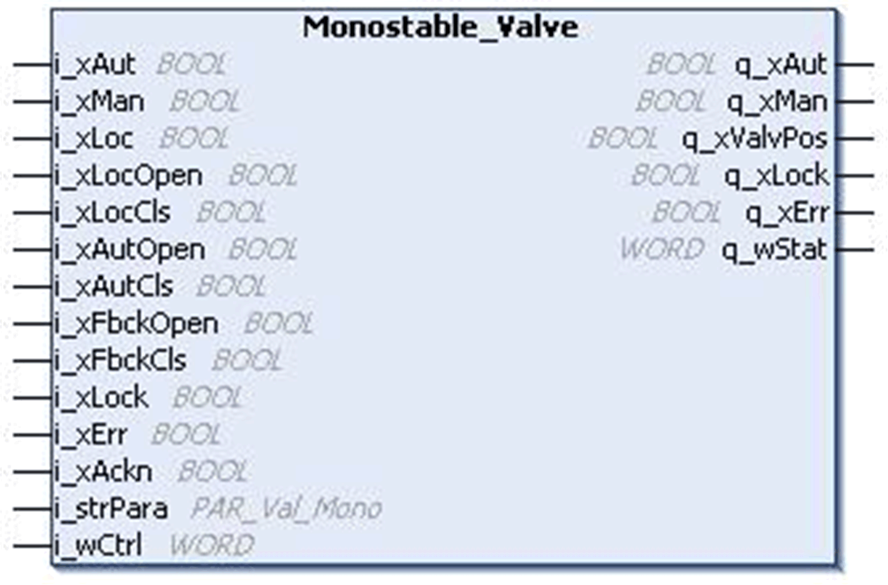

# `Monostable_Valve` Function Block

## Pin Diagram

This figure shows the pin diagram of the `Monostable_Valve` function block:

## Functional Description

The `Monostable_Valve` function block is used for controlling the monostable valve.

## Operation Modes

The `Monostable_Valve` function block supports three operating modes:

* **Automatic Mode:** The automatic mode is activated by the input pin `i_xAut`. In this mode the valve is opened and closed through the inputs `i_xAutOpen` (default position is Closed) and `i_xAutCls` (default position is Open) respectively, regardless of the local mode being activated or not. The output `q_xValvPos` remains active as long as the inputs `i_xAutOpen`/`i_xAutCls` remain active.
* **Manual Mode:** The manual mode is activated by the pin `i_xMan`.

  *Case 1:*  Local mode is not activated. The valve is opened and closed through the bit commands of the signal `i_dwCtrl`.

  *Case 2:*  Local mode is activated. The valve is opened and closed through the input signals `i_xLocOpen` and `i_xLocCls` respectively.
* **Local Mode:** Local mode is activated by an input pin `i_xLoc` and is set additionally to automatic or manual mode. Local mode does not influence the automatic mode, but changes the source for manual operation.

NOTE: If both automatic and manual modes are selected simultaneously (inputs `i_xAut` and `i_xMan` are set to 1), the operation mode is invalid, which is indicated at the `q_xErr` output.

## Controller Start Up Behavior

The block is de-activated on controller start and remains in the same operation mode, unless a new one is selected.

## Supervising the Valve

The position of the valve is supervised by the feedback signals `i_xFbckOpen` and `i_xFbckCls`. Once the operation is started, the feedback inputs must signal the right position of the valve within a defined time. If this time exceeds, then the block indicates a detected error (missing feedback detected error).The time can be set through the structure element `iFbckDly` at input `i_strPara`. The supervision can be switched Off by the structure element `xFbckEn` at the input `i_strPara`.

## Operating the Valve

The valve can be operated only if the input `i_xLock` is set to 0. An active interlock signal inhibits the operation of the valve and is indicated by the output pin `q_xLock`.

The valve can only be operated if the output `q_xErr` is set to 0. An active detected error signal inhibits the operation of the valve.

## Detected Error Management

The output `q_xErr` is high, only if an error is detected. The detected error can be:

* Internal detected error (invalid operation mode, missing feedback signal or unknown position).
* External detected error

Detected errors are indicated in the HMI as alarms. If an interlock or an error is detected during the operation of the valve, the behaviour of the function block depends on the structure element `i_strPara.xFrceEn` at input `i_strPara`. If this element is set to 1, the block enforces the valve to move in to the default position, and the corresponding output is high (`q_xOpen` or `q_xCls`) for the duration of `i_strPara.iFbckDly` seconds. Otherwise the operation is stopped and has to be restarted after the interlock is gone.

To reset `q_xErr`, the detected error has to be acknowledged by a rising edge on the input `i_xAckn` or by using bit 16 of the signal `i_dwCtrl`.

## Setting Default Position

The default position of the valve can be set by `i_strPara.xPosDflt`. This description assumes Close as default. If `i_strPara.xPosDflt` is set to 1, Open is the default position.

EIO0000000096.09