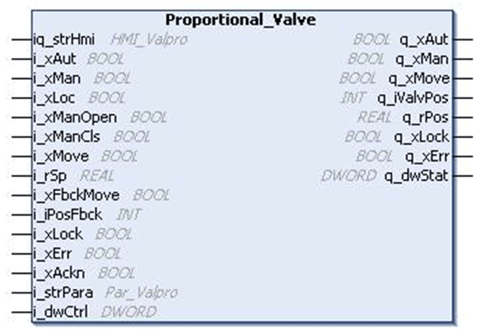

# `Proportional_Valve` Function Block

## Pin Diagram

This figure shows the pin diagram of the `Proportional_Valve` function block:

## Functional Description

The `Proportional_Valve` function block is used for controlling proportional valve.

## Operation Modes

The `Proportional_Valve` function block supports three operating modes:

* **Automatic Mode:** The automatic mode is activated by the input pin `i_xAut`. In this mode, the valve is opened and closed via the input `i_xMove`, regardless if the local mode is activated or not. The new set point is given at the input `i_rSp`.
* **Manual Mode:** The manual mode is activated by the pin `i_xMan`.

  *Case 1:*  Local mode is not activated. The valve is opened and closed through a bit command in the variable `i_dwCtrl` and the value of the set point is given by `rSP` on the input-output `iq_strHmi`

  *Case 2:*  Local mode is activated. The valve is operated through the inputs `i_xManOpen` and `i_xManCls`.
* **Local Mode:** The local mode is activated by an input pin `i_xLoc` and is set additionally to the automatic or manual mode. The local mode does not influence the automatic mode, but changes the source for manual operation. The output `q_iValvPos` is automatically set to `i_strPara.rMinSp` when using `i_xManCls` or `i_strPara.rMaxSp` when using `i_xManOpen`.

NOTE: If the operation mode is changed from manual or HMI mode to automatic mode, a movement of the valve is stopped. Any other change of the operation mode does not affect the valve movement, but the setpoint is adjusted to the value of the actual operation mode.

## Output Behavior

The output `q_xMove` remains active as long as the new position given by the setpoint is not reached.

## Setting a Deadband

A deadband can be set by `i_strPara.rBnd`, so that `q_xMove` is switched Off, when the deviation of actual position and setpoint is less than the deadband.

When using the inputs `i_xManOpen` and `i_xManCls` in local mode, the output `q_xMove` is active as long as the inputs are active or if the maximum or minimum position is reached (taking dead band into consideration).

## Supervising the Valve

The position of the valve is supervised by the feedback signals `i_xFbckOpen` and `i_xFbckCls`. Once the operation is started, the feedback inputs must signal the right position of the valve within a defined time. If this time exceeds, then the block indicates a detected error. The time can be set through the structure element `iFbckDly` at input `i_strPara`. The supervision can be switched Off by the structure element `xFbckEn` at the input `i_strPara`.

## Operating the Valve

The valve can be operated if the input `i_xLock` is set to 0. An active interlock signal inhibits the operation of the valve. An active interlock is indicated by the output `q_xLock`.

The valve can only be operated, if the output `q_xErr` is set to 0. An active detected error signal inhibits the operation of the valve.

## Detected Error Management

The output `q_xErr` is high if an error is detected. The detected error can be:

* Internal detected error (invalid operation mode, missing feedback signal or unknown position.
* External detected error

The detected errors are indicated in the HMI as alarms. If an interlock or an error is detected during the operation of the valve, the behaviour of the function block depends on the structure element `i_strPara.xFrceEn` at input `i_strPara`. If this element is set to 1, the block enforces the valve to move in to the default position, and the output is high (`q_xMove`) for the duration of `i_strPara.iFbckDly` seconds. Otherwise the operation is stopped and has to be restarted after the interlock is gone.

To reset the `q_xErr`, the detected error has to be acknowledged by a rising edge on the input `i_xAckn` or by using bit 16 of the signal `i_dwCtrl`.

## Setting Default Position

The default position of the valve can be set by `i_strPara.xPosDfltSet`. This description assumes Close as default. If `i_strPara.xPosDflt` is set to 1, Open is the default position.

EIO0000000096.09