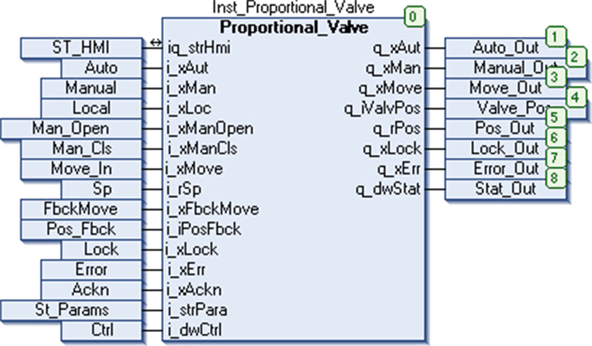

# Instantiation and Usage Example

## Instantiation and Usage Example

This figure shows an instance of the `Proportional_Valve` function block:

## Limitations

If feedback is enabled by setting `i_strPara.xFbEn` = 1, then not only the movement feedback has to come at the input `i_xFbckMove` but also the valve has to reach the setpoint within the specified time `i_strPara.iFbTime`.

If `i_strPara.rMinSp` = `i_strPara.rMaxSp` = `i_rSP` and the block is set in auto mode, then both the bits of status word `q_dwStat` for valve open and valve close is set to 1.

While operating with feedback enabled, even if no move feedback is received by the block but the valve reaches setpoint within the specified time, then no error is detected.

## Priority Management Limitations

While operating in manual mode with local control, inputs `i_xManOpen` and `i_xManCls` given together does not produce any result until one of them is withdrawn. However in this case, the value of output `q_iValvPos` is unpredictable as long as both inputs are high.

EIO0000000096.09