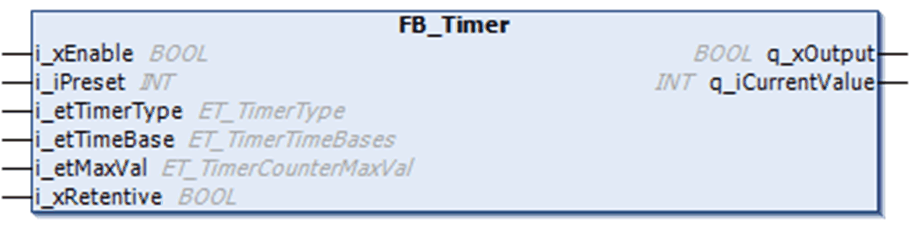

# Overview

Overview

The following graphic shows the pin diagram of the [function block](../glossary/glossary.htm#XREF_D_SE_0024697_715)  FB\_Timer:

The [function block](../glossary/glossary.htm#XREF_D_SE_0024697_715) %TM in EcoStruxure Machine Expert - Basic can configure 3 types of timers:

oTON (Timer On-Delay): this type of timer is used to control on-delay actions.

oTOF (Timer Off-Delay): this type of timer is used to control off-delay actions.

oTP (Timer-Pulse): this type of timer is used to create a pulse of a precise duration.

For more information refer to the CoDeSys online help in EcoStruxure Machine Expert: CoDesSys-Libraries/Standard Library/Timer.

NOTE: When changing the timer type online while i\_xEnable is TRUE, the formerly selected timer type is reset and the new timer type starts. FB outputs behave according the newly selected timer.