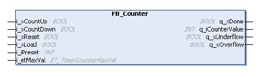

# Overview

Overview

The function block FB\_Counter provides up and down counting of events.

The following graphic shows the pin diagram of the [function block](../glossary/glossary.htm#XREF_D_SE_0024697_715) FB\_Counter:

