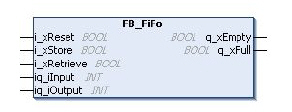
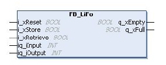

# Overview

Overview

The register function block in EcoStruxure Machine Expert - Basic has 2 types:

oQueue (FIFO)

oStack (LIFO)

The following graphics show the pin diagrams of the function blocks FB\_FiFo and FB\_LiFo:

