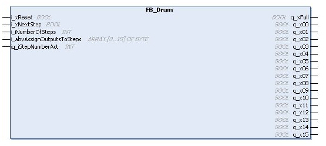

# Overview

Overview

The drum controller operates on a principle similar to an electromechanical drum controller. The drum can provide up to 8 states which are engaged cyclically. While a rising edge at the input i\_xNextStep turns the drum further, the actual step number can also be set by the software.

Each drum state activates a pattern of up to 16 control bits so that the drum controller represents a kind of state machine.

The following graphic shows the pin diagram of the function block FB\_Drum:

