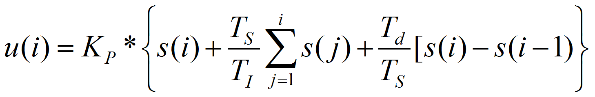

# Overview

Overview

The function block FB\_PID provides a [PID](../glossary/glossary.htm#XREF_D_SE_0024697_347) controller.

The following graphic shows a pin diagram of the function block FB\_PID:

The main algorithm is represented by the following flow chart:

The main algorithm is calculated as:

While a derivative time constant of Td=0 will disable the derivative branch of the PID controller, a proportional gain Kp of 0 is prohibited. This would result in a gain of 100%.

Setting the integral time constant Ti=0 will switch to an alternate calculation rule:

This would center the analog output signal which is in a range [0..10000].

The measured value can be converted into a parametrized range. This new range will then be applied to the setpoint as well as to the measure alarm levels.

In each case, the output is in a range [0..10000] but can be limited.