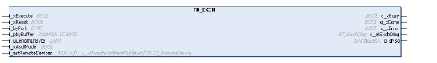

# Overview

Overview

The following graphic shows the pin diagram of the function block FB\_EXCH:

The M221 controller can communicate with a Modbus slave device or can send/receive messages in character mode (ASCII).

Twido and EcoStruxure Machine Expert - Basic provide the following functions for communication:

oEXCH instruction to transmit/receive messages

oExchange control function block (MSG) to control the data exchanges

The TwidoEmulationSupport library handles the communication with the function block FB\_EXCH. This function block uses the function block SEN.SEND\_RECV\_MSG of the PLCCommunication library. This has the functionality to send and receive user-defined messages and waits for a response.