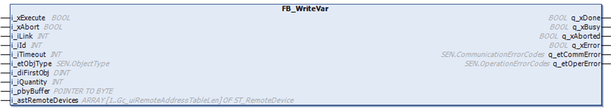

# Overview

Overview

The following graphic shows the pin diagram of the function block FB\_WriteVar:

The function block FB\_WriteVar writes data to an external device using the Modbus SL or Modbus TCP protocol.