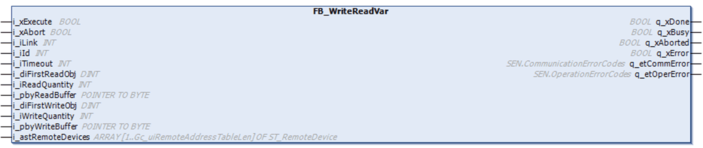

# Overview

Overview

The function block FB\_WriteReadVar can be used to:

owrite consecutive internal registers and read back their values in the same execution cycle of the function block (single transaction),

owrite consecutive internal registers and read different registers.

The following graphic shows the pin diagram of the function block FB\_WriteReadVar:

The function block FB\_WriteReadVar reads and writes internal registers (MW type only) to an external device in the Modbus protocol. The read and write operations are contained in a single transaction. Note that the write operation is performed first.