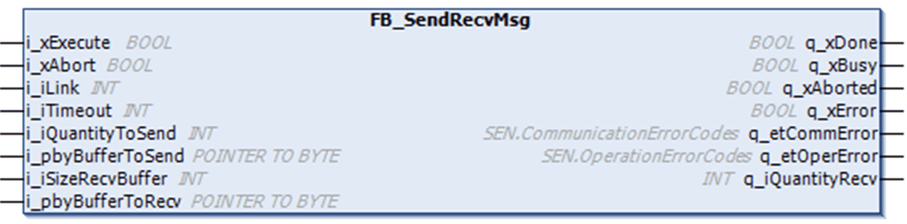

# Overview

Overview

The following graphic shows the pin diagram of the function block FB\_SendRecvMsg:

The function block FB\_SendRecvMsg sends and receives user-defined messages. It sends a message on a serial line and then waits for a response. It is also possible to either send without waiting for a response or to receive a message without sending one. This function should be used with an ASCII manager.