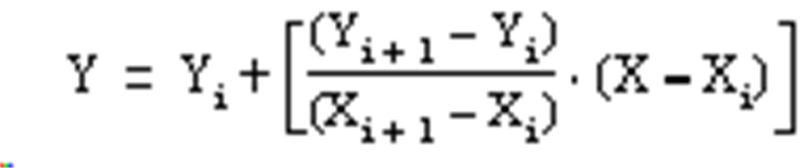

# FC_Lkup

FC\_Lkup

The function FC\_Lkup is used to interpolate a set of X versus Y floating point data for a given X value.

|  |  |
| --- | --- |
| Name in EcoStruxure Machine Expert - Basic / Twido | LKUP |
| Input values | i\_prStartAddr : POINTER TO REAL  i\_bySize : BYTE |
| Return values | FC\_Lkup : INT |

The following conditions apply for the input value i\_prSartAddr:

oeven number of values

ominimum of 6 values

ofirst element is x value to be found

osecond element is set by the function: interpolation result

oall following elements are interpolation supporting points by pairs of X and Y

Interpolation rules:

The LKUP function uses the linear interpolation rule, as defined in the following equation:

For Xi  ≤ X  ≤  Xi + 1, where i = 1 … (m-1)

Assuming Xi values are ranked in ascending order: X1 ≤ X2 ≤ ...X...≤ Xm-1 ≤ Xm

If any of 2 consecutive Xi values are equal (Xi=Xi+1=X), the equation 1 results in an invalid exception. To handle this exception, the following algorithm is used in place of equation 1:

For Xi = Xi+1 = X, where i = 1…(m-1).

Result value:

The result value shows if the interpolation was successful or not.

0: Successful interpolation

1: Interpolation error: incorrect array, Xm < Xm-1

2: Interpolation error: i\_rXValue out of range, X < X1

4: Interpolation error: i\_rXValue out of range, X > Xm

8: Invalid size of data array: i\_prYValue is set as an odd number, or i\_prYValue < 6

The result value does not contain the computed interpolation value (Y). For a given (X) value, the result of the interpolation (Y) is contained in i\_prYValue.

i\_rXValue is the floating point variable that contains the user-defined (X) value for which to compute the interpolated (Y) value.

The valid range for i\_rXValue is:

X1 ≤  i\_rXValue  ≤ Xm