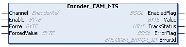

# Encoder\_CAM\_NTS: Associates Tracks

## Function Block Description

The Encoder\_CAM\_NTS function block allows you to modify the association between the tracks and the physical outputs of the Modicon Edge I/O NTS Expert I/O Module (for example, NTSECS0121).

For further information, refer to [CAM Mode Principle Description](../../../../../api/crossBook?lang=en-US&virtualBookName=EdgeIO_NTS_Exp_UG&topicID=CAMModePrincipleDescription_5EE78856).

## Graphical Representation

## I/O Variables Description

This table describes the input variables:

| Input | Data type | Description |
| --- | --- | --- |
| Channel | EncoderRef | Reference to the encoder instance. |
| Enable | BYTE | When the bit associated to the output is TRUE, set the output value according to the track that is to be associated (if SingleTurnPos is valid).   * Bit 0 is associated to output 0.  ... * Bit 7 is associated to output 7. |
| Force | BYTE | When TRUE, the bit associated to the output is forced regarding the value of the input ForcedValue. The value of the Enable input is ignored.   * Bit 0 is associated to output 0.  ... * Bit 7 is associated to output 7. |
| ForcedValue | BYTE | Value to apply to the output Value when the input Force is set.   * Bit 0 is associated to output 0.  ... * Bit 7 is associated to output 7. |

This table describes the output variables:

| Output | Data type | Comment |
| --- | --- | --- |
| EnabledFlag | BOOL | TRUE indicates that the output values on the function block are valid. If the function block is disabled, the output is set to FALSE. |
| Value | BYTE | Value of the output.   * Bit 0 is associated to output 0.  ... * Bit 7 is associated to output 7. |
| TrackStatus | UINT | Each bit represents the status of the corresponding track.   * Bit 0 is associated to track 0.  ... * Bit 15 is associated to track 15. |
| ErrorFlag | BOOL | TRUE indicates that an error is detected and the CAM outputs are disabled.  The CAM outputs are disabled.  You can trigger a rising edge on Enable to reset the detected error. |
| ErrorId | [ENCODER\_ERROR\_ID](ENC_ERRORID-8DD83449.html) | Indicates the identification number of the detected error when ErrorFlag is TRUE. |

EIO000005480.01