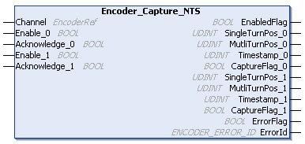

# Encoder\_Capture\_NTS: Captures the Encoder Position

## Function Block Description

The Encoder\_Capture\_NTS function block is used to capture the encoder position with two different capture inputs.

For further information, refer to [Capture Sub-Function](../../../../../api/crossBook?lang=en-US&virtualBookName=EdgeIO_NTS_Exp_UG&topicID=CaptureInputInterface_088AB3D3).

## Graphical Representation

## I/O Variable Description

This table describes the input variables:

| Input | Data Type | Description |
| --- | --- | --- |
| Channel | EncoderRef | Reference to the encoder instance. |
| Enable\_0 | BOOL | When TRUE, the capture input 0 captures the encoder position. The output CaptureFlag\_0 is set to TRUE and capture 0 is locked if the parameter [Autolock of the capture sub-function](../../../../../api/crossBook?lang=en-US&virtualBookName=EdgeIO_NTS_Exp_UG&topicID=CaptureInput_07F16311) is TRUE.  Default value: FALSE |
| Acknowledge\_0 | BOOL | When a rising edge is detected, the output CaptureFlag\_0 is reset and capture 0 is unlocked if the parameter Autolock of the capture sub-function is TRUE.  Default value: FALSE |
| Enable\_1 | BOOL | When TRUE, the capture input 1 captures the encoder position. The output CaptureFlag\_1 is set to TRUE and capture 1 is locked if the parameter Autolock of the capture sub-function is TRUE.  Default value: FALSE |
| Acknowledge\_1 | BOOL | When a rising edge is detected, the output CaptureFlag\_1 is reset and capture 1 is unlocked if the parameter Autolock of the capture sub-function is TRUE.  Default value: FALSE |

This table describes the output variables:

| Output | Data Type | Comment |
| --- | --- | --- |
| EnabledFlag | BOOL | TRUE indicates that the output values on the function block are valid. If the function block is disabled, the output is set to FALSE. |
| SingleTurnPos\_0 | UDINT | SingleTurnPos value captured at the capture condition 0 event.  The value is refreshed whenever a rising edge is detected at CaptureFlag\_0. |
| MultiTurnPos\_0 | UDINT | MultiTurnPos value captured at the capture condition 0 event.  MultiTurnPos values are exclusive to the encoder modes SSI and BiSS-C.  The value is refreshed whenever a rising edge is detected at CaptureFlag\_0. |
| Timestamp\_0 | UDINT | Indicates the time of position 0 capturing. |
| CaptureFlag\_0 | BOOL | When TRUE, the captured value at capture input 0 is valid and capture 0 is locked if the parameter Autolock of the capture sub-function is TRUE.  A rising edge at input Acknowledge\_0 resets the output CaptureFlag\_0 and unlocks capture 0 if the parameter Autolock of the capture sub-function is TRUE. |
| SingleTurnPos\_1 | UDINT | SingleTurnPos value captured at the capture condition 1 event.  The value is refreshed whenever a rising edge is detected at CaptureFlag\_1. |
| MultiTurnPos\_1 | UDINT | MultiTurnPos value captured at the capture condition 1 event.  MultiTurnPos values are exclusive to the encoder modes SSI and BiSS-C.  The value is refreshed whenever a rising edge is detected at CaptureFlag\_1. |
| Timestamp\_1 | UDINT | Indicates the time of position 1 capturing. |
| CaptureFlag\_1 | BOOL | When TRUE, the captured value at capture input 1 is valid and capture 1 is locked if the parameter Autolock of the capture sub-function is TRUE.  A rising edge at input Acknowledge\_1 resets the output CaptureFlag\_1 and unlocks capture 1 if the parameter Autolock of the capture sub-function is TRUE. |
| ErrorFlag | BOOL | TRUE indicates that an error is detected.  The error needs to be resolved to continue capturing. You can trigger a rising edge on Enable\_0 or Enable\_1 to reset the detected error. |
| ErrorId | [ENCODER\_ERROR\_ID](ENC_ERRORID-8DD83449.html) | Indicates the identification number of the detected error when ErrorFlag is TRUE. |

EIO000005480.01