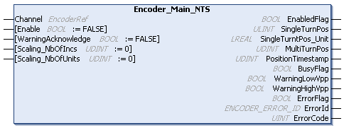

# Encoder\_Main\_NTS: Enables the Encoder Counting

## Function Block Description

The Encoder\_Main\_NTS function block is used to enable the encoder counting.

## Graphical Representation

## I/O Variable Description

This table describes the input variables:

| Input | Data type | Description |
| --- | --- | --- |
| Channel | EncoderRef | Reference to the encoder instance. |
| Enable | BOOL | TRUE enables the function block.  When a rising edge is detected, the values of the following scaling parameters are taken into account:   * Scaling\_NbOfIncs * Scaling\_NbOfUnits   If you modify these values, trigger a rising edge on this Enable input to take them into account.  Default value: FALSE |
| WarningAcknowledge | BOOL | This input is exclusive to the SinCos mode. For further information, refer to [SinCos Mode Principle Description](../../../../../api/crossBook?lang=en-US&virtualBookName=EdgeIO_NTS_Exp_UG&topicID=SinCosModePrincipleDescription_862FF4E3).  When a rising edge is detected, the parameters WarningLowVpp and WarningHighVpp are reset.  Default value: FALSE |
| Scaling\_NbOfIncs | UDINT | 0 indicates that the scaling is disabled. The value in user units of SingleTurnPos\_Unit is equal to the value in pulses SingleTurnPos.  A value that is greater than 0 indicates that the scaling is enabled.  The value in user units is calculated from the value in pulses SingleTurnPos, such as:  SingleTurnPos\_Unit = SingleTurnPos \* (Scaling\_NbOfUnits / Scaling\_NbOfIncs)  Default value: 0 |
|  |
| Scaling\_NbOfUnits | UDINT | 0 indicates that the scaling is disabled. The value in user units of SingleTurnPos\_Unit is equal to the value in pulses SingleTurnPos.  A value that is greater than 0 indicates that the scaling is enabled.  The value in user units is calculated from the value in pulses SingleTurnPos, such as:  SingleTurnPos\_Unit = SingleTurnPos \* (Scaling\_NbOfUnits / Scaling\_NbOfIncs)  Default value: 0 |
|  |

This table describes the output variables:

| Output | Data type | Description |
| --- | --- | --- |
| EnabledFlag | BOOL | TRUE indicates that the output values on the function block are valid. If the function block is disabled, the output is set to FALSE.  Default value: FALSE |
| SingleTurnPos | ULINT | Indicates a single-turn position of the machine in pulses.  Refreshed with each cycle. |
| SingleTurnPos\_Unit | LREAL | 0 indicates that the scaling is disabled. The value of SingleTurnPos\_Unit is equal to SingleTurnPos.  A value that is unequal to 0 indicates that the scaling is enabled.  The value of SingleTurnPos\_Unit is calculated from  SingleTurnPos \* Scaling\_NbOfUnits / Scaling\_NbOfIncs  Default value: 0 |
|  |
| MultiTurnPos | UDINT | Indicates a multi-turn position of the machine in pulses.  Refreshed with each cycle. |
| PositionTimestamp | UDINT | Indicates the time of position capturing. |
| BusyFlag | BOOL | When TRUE, indicates that the encoder is being enabled. |
| WarningLowVpp | BOOL | When TRUE, the lower limit of the SinCos signal (low Vpp) is not taken into account. |
| WarningHighVpp | BOOL | When TRUE, the upper limit of the SinCos signal (high Vpp) is not taken into account. |
| ErrorFlag | BOOL | TRUE indicates that an error is detected.  You can trigger a rising edge on Enable to reset the detected error.  Default value: FALSE |
| ErrorId | [ENCODER\_ERROR\_ID](ENC_ERRORID-8DD83449.html) | Indicates the identification number of the detected error when ErrorFlag is TRUE. |
| ErrorCode | UINT | Indicates the code of the detected error when ErrorFlag is TRUE and ErrorId is PROTOCOL. |

EIO000005480.01