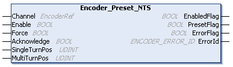

# Encoder\_Preset\_NTS: Presets the Encoder

## Function Block Description

The Encoder\_Preset\_NTS function block is used to preset the encoder with a reference position value.

For further information, refer to [Preset Sub-Function](../../../../../api/crossBook?lang=en-US&virtualBookName=EdgeIO_NTS_Exp_UG&topicID=PresetInterface_088A9618).

## Graphical Representation

## I/O Variable Description

This table describes the input variables:

| Inputs | Data type | Description |
| --- | --- | --- |
| Channel | EncoderRef | Reference to the encoder instance. |
| Enable | BOOL | When TRUE, the encoder preset sub-function is enabled and when a preset event is detected, a preset is triggered and the PresetFlag output is set to TRUE.  Default value: FALSE |
| Force | BOOL | When a rising edge is detected, the preset is forced and the PresetFlag output is set to TRUE.  Default value: FALSE |
| Acknowledge | BOOL | When a rising edge is detected, the PresetFlag output is reset.  Default value: FALSE |
| SingleTurnPos | UDINT | Sets the preset position for single-turn bits.  NOTE: It is not verified whether the position is within the valid range. |
| MultiTurnPos | UDINT | MultiTurnPos values are exclusive to the encoder modes SSI and BiSS-C.  Sets the preset position for multi-turn bits.  NOTE: It is not verified whether the position is within the valid range. |

This table describes the output variables:

| Output | Data type | Description |
| --- | --- | --- |
| EnabledFlag | BOOL | TRUE indicates that the output values on the function block are valid. If the function block is disabled, the output is set to FALSE. |
| PresetFlag | BOOL | TRUE indicates that a preset is performed.  Default value: FALSE |
| ErrorFlag | BOOL | TRUE indicates that an error is detected.  You can trigger a rising edge on Enable to reset the detected error.  Default value: FALSE |
| ErrorId | [ENCODER\_ERROR\_ID](ENC_ERRORID-8DD83449.html) | Indicates the identification number of the detected error when ErrorFlag is TRUE. |

EIO000005480.01