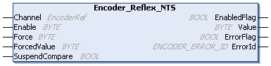

# Encoder\_Reflex\_NTS: Sets Threshold Values

## Function Block Description

The Encoder\_Reflex\_NTS function block is used to set outputs on threshold values.

For further information, refer to [Reflex Output and Compare Sub-Function](../../../../../api/crossBook?lang=en-US&virtualBookName=EdgeIO_NTS_Exp_UG&topicID=CompareAndReflexOutputFunction_344AED6A).

## Graphical Representation

## I/O Variable Description

This table describes the input variables:

| Input | Data type | Description |
| --- | --- | --- |
| Channel | EncoderRef | Reference to the encoder instance. |
| Enable | BYTE | Bit field used to enable reflex outputs 0 through 3.  When the bit associated to the output is TRUE, set the output used for the reflex value (if SingleTurnPos is valid).   * Bit 0 is associated to reflex 0. * Bit 1 is associated to reflex 1. * Bit 2 is associated to reflex 2. * Bit 3 is associated to reflex 3.   Bits 4...7 are reserved. |
| Force | BYTE | Bit field used to force reflex outputs 0 through 3.  When TRUE, the associated bit corresponding to the reflex value is forced regarding the value of the output [ReflexForcedValue of the reflex output and compare sub-function](../../../../../api/crossBook?lang=en-US&virtualBookName=EdgeIO_NTS_Exp_UG&topicID=CompareFunction_87396D6F). The value of the Enable input is ignored.   * Bit 0 is associated to reflex 0. * Bit 1 is associated to reflex 1. * Bit 2 is associated to reflex 2. * Bit 3 is associated to reflex 3.   Bits 4...7 are reserved. |
| ForcedValue | BYTE | Bit field of the forced values for reflex outputs 0 through 3.  Value to apply when the function block output [ReflexForce of the reflex output and compare sub-function is set](../../../../../api/crossBook?lang=en-US&virtualBookName=EdgeIO_NTS_Exp_UG&topicID=CompareFunction_87396D6F).   * Bit 0 is associated to reflex 0. * Bit 1 is associated to reflex 1. * Bit 2 is associated to reflex 2. * Bit 3 is associated to reflex 3.   Bits 4...7 are reserved. |
| SuspendCompare | BOOL | When TRUE, the reflex output values are latched and maintained independently of the present values of the encoder and the threshold values.  If SuspendCompare is TRUE, a reflex output can still be forced to the ForcedValue with the Force input. |

This table describes the output variables:

| Output | Data type | Description |
| --- | --- | --- |
| EnabledFlag | BOOL | TRUE indicates that the output values on the function block are valid. If the function block is disabled, the output is set to FALSE. |
| Value | BYTE | Present value of the reflex bit.   * Bit 0 is associated to reflex 0. * Bit 1 is associated to reflex 1. * Bit 2 is associated to reflex 2. * Bit 3 is associated to reflex 3.   Bits 4...7 are reserved.  NOTE: The physical outputs depend on the configured channel. For further information, refer to [Reflex Output and Compare Sub-Function](../../../../../api/crossBook?lang=en-US&virtualBookName=EdgeIO_NTS_Exp_UG&topicID=CompareAndReflexOutputFunction_344AED6A). |
| ErrorFlag | BOOL | TRUE indicates that an error is detected.  You can trigger a rising edge on Enable to reset the detected error.  Default value: FALSE |
| ErrorId | [ENCODER\_ERROR\_ID](ENC_ERRORID-8DD83449.html) | Indicates the identification number of the detected error when ErrorFlag is TRUE. |

EIO000005480.01