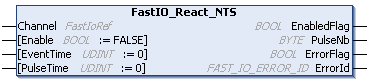

# FastIO\_React\_NTS: Generates Output Pulse

## Function Block Description

The FastIO\_React\_NTS function block supports the Output Pulse After Input Event mode and generates an output pulse after an input edge and a delay. For further information, refer to [Output Pulse After Input Event Mode Principle Description](../../../../../api/crossBook?lang=en-US&virtualBookName=EdgeIO_NTS_Exp_UG&topicID=OutputPulseAfterInputEventModePrinc_8736A0D9).

## Graphical Representation

## I/O Variable Description

This table describes the input variables:

| Input | Data type | Description |
| --- | --- | --- |
| Channel | FastIoRef | Reference to the fast I/O instance. |
| Enable | BOOL | When TRUE, the input is monitored and the pulse generation is enabled.  Default value: FALSE |
| EventTime | UDINT | The time (in ns) between detecting the input event and generating the output pulse.  Value range: 0...4294967295  Default value: 0 |
| PulseTime | UDINT | The duration (in ns) of the generated output pulse.  Value range: 0...4294967295  Default value: 0 |

This table describes the output variables:

| Output | Data type | Description |
| --- | --- | --- |
| EnabledFlag | BOOL | TRUE indicates that the output values on the function block are valid. If the function block is disabled, the output is set to FALSE. |
| PulseNb | BYTE | The number of pulses that are generated when an input event is detected.  Default value: 0 |
| ErrorFlag | BOOL | TRUE indicates that an error is detected.  You can trigger a rising edge on Enable to reset the detected error.  Default value: FALSE |
| ErrorId | [FAST\_IO\_ERROR\_ID](FAST_ERRORID-915D293A.html) | Indicates the identification number of the detected error when ErrorFlag is TRUE. |

EIO000005480.01