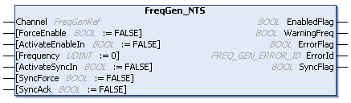

# FreqGen\_NTS: Commands a Square Wave Signal

## Function Block Description

The FreqGen\_NTS function block supports the Frequency Generator mode and commands a square wave signal output at the specified frequency. For further information, refer to [Frequency Generator Mode Principle Description](../../../../../api/crossBook?lang=en-US&virtualBookName=EdgeIO_NTS_Exp_UG&topicID=TPC_FrequencyGeneratorModePrinciple_C4F3FEA3).

## Graphical Representation

## I/O Variable Description

This table describes the input variables:

| Input | Data type | Description |
| --- | --- | --- |
| Channel | FreqGenRef | Reference to the frequency generator instance. |
| ForceEnable | BOOL | When TRUE, forces the pulse generation. The ActivateEnableIn input is ignored.  Default value: FALSE |
| ActivateEnableIn | BOOL | When TRUE, enables pulse generation provided that the [EnConfigured input](../../../../../api/crossBook?lang=en-US&virtualBookName=EdgeIO_NTS_Exp_UG&topicID=FrequencyGeneratorInterfaceConfigur_828CE9AC) is TRUE.  Default value: FALSE |
| Frequency | UDINT | Frequency to apply to the pulse generation in steps of 0.1 Hz.  Value range: 0...1,000,000 (0...100 kHz)  Default value: 0 |
| ActivateSyncIn | BOOL | When TRUE, the synchronization is started when a [SyncConfigured input parameter](../../../../../api/crossBook?lang=en-US&virtualBookName=EdgeIO_NTS_Exp_UG&topicID=FrequencyGeneratorInterfaceConfigur_828CE9AC) is defined other than 0 and the SyncFlag output is set to TRUE.  Default value: FALSE |
| SyncForce | BOOL | When a rising edge is detected, forces the synchronization and sets the SyncFlag output to TRUE independently of the defined [SyncConfigured input parameter](../../../../../api/crossBook?lang=en-US&virtualBookName=EdgeIO_NTS_Exp_UG&topicID=FrequencyGeneratorInterfaceConfigur_828CE9AC).  Default value: FALSE |
| SyncAck | BOOL | When a rising edge is detected, the SyncFlag output is reset.  Default value: FALSE |

This table describes the output variables:

| Output | Data type | Description |
| --- | --- | --- |
| EnabledFlag | BOOL | TRUE indicates that the output values on the function block are valid. If the function block is disabled, the output is set to FALSE. |
| WarningFreq | BOOL | When TRUE, the value of the input Frequency exceeds the maximum frequency. The applied frequency is the maximum frequency.  Default value: FALSE |
| ErrorFlag | BOOL | TRUE indicates that an error is detected.  Pulse generation is stopped.  You can trigger a rising edge on ForceEnable to reset the detected error.  Default value: FALSE |
| ErrorId | [FREQ\_GEN\_ERROR\_ID](FREQ_ERRORID-917DEDF1.html) | Indicates the identification number of the detected error when ErrorFlag is TRUE. |
| SyncFlag | BOOL | When TRUE, synchronization is being performed.  Default value: FALSE |

EIO000005480.01