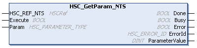

# HSC\_GetParam\_NTS: Returns Parameters of HSC

## Function Block Description

The HSC\_GetParam\_NTS administrative function block returns a parameter value of a High Speed Counter (HSC).

## Graphical Representation

## I/O Variables Description

This table describes the input variables:

| Inputs | Type | Comment |
| --- | --- | --- |
| HSC\_REF\_NTS | HSCRef | Reference of the HSC instance.  Must not be changed during function block execution. |
| Execute | BOOL | When a rising edge is detected, the function block starts execution.  When a falling edge is detected, the function block stops execution and the outputs are reset. |
| Param | [HSC\_PARAM\_TYPE\_NTS](HSC_PARAM_TYPE_NTS-3A44E582.html) | Parameter to read. |

This table describes the output variables:

| Outputs | Type | Comment |
| --- | --- | --- |
| Done | BOOL | TRUE indicates that ParameterValue is valid.  Function block execution is finished. |
| Busy | BOOL | TRUE indicates that the function block is busy processing data. |
| Error | BOOL | TRUE indicates that an error is detected. Function block execution is finished. |
| ErrorId | [HSC\_ERROR\_NTS](HSC_ERROR_NTS-3A48D241.html) | Indicates the identification number of the detected error when Error is TRUE. |
| ParameterValue | DINT | Value of the parameter that has been read. |

NOTE: For more information about the Done, Busy, Error, and ErrorId parameters, refer to [General Information](InfoFBMan-56A3073B.html).

EIO000005480.01