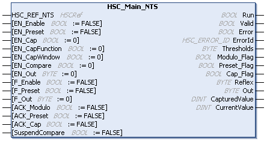

# HSC\_Main\_NTS: Control a Main Type Counter for Edge I/O

## Function Block Description

The HSC\_Main\_NTS function block controls a Main type counter with the following functions:

| Function | Refer to the chapter in the Modicon Edge I/O NTS Counting Modules User Guide for further information |
| --- | --- |
| Frequency meter | [Frequency Meter Function](../../../../../api/crossBook?lang=en-US&virtualBookName=EdgeIO_NTS_Cnt_UG&topicID=FrequencyMeterFunction_E04E616C) |
| Ratio meter | [Ratio Meter Function](../../../../../api/crossBook?lang=en-US&virtualBookName=EdgeIO_NTS_Cnt_UG&topicID=RatioMeterFunction_E051A77D) |
| Period meter | [Period Meter Function](../../../../../api/crossBook?lang=en-US&virtualBookName=EdgeIO_NTS_Cnt_UG&topicID=PeriodMeterFunction_E04FA1B3) |
| Single event counting | [Single Phase Event Counting Function](../../../../../api/crossBook?lang=en-US&virtualBookName=EdgeIO_NTS_Cnt_UG&topicID=TPC_EDGEIOCountingSinglePhaseEventC_E347DB2B) |
| Single phase counting | [Single Phase Counting Function](../../../../../api/crossBook?lang=en-US&virtualBookName=EdgeIO_NTS_Cnt_UG&topicID=SinglePhaseCountingFunction_E0D54398) |
| Dual phase counting | [Dual Phase Counting Function](../../../../../api/crossBook?lang=en-US&virtualBookName=EdgeIO_NTS_Cnt_UG&topicID=TPC_EDGEIODualPhaseCountingFunction_E348FA7A) |
| Reflex | [Reflex Output Sub Function](../../../../../api/crossBook?lang=en-US&virtualBookName=EdgeIO_NTS_Cnt_UG&topicID=TPC_EDGEIOCountingReflexOutputSubFu_E349278D) |

The HSC\_Main\_NTS function block is mandatory when using Main counter.

The function block instance name must match the name defined by configuration. Hardware related information managed by this function block is synchronized with the MAST task cycle.

| WARNING | |
| --- | --- |
|  | UNINTENDED OUTPUT VALUES  * Only use the function block instance in the MAST task. * Do not use the same function block instance in a different task.  Failure to follow these instructions can result in death, serious injury, or equipment damage. |

NOTE: Forcing the logical output values of the function block is allowed by EcoStruxure Machine Expert but it will have no impact on physical outputs if the function is active (executing).

## Graphical Representation

## I/O Variables Description

This table describes the input variables:

| Input | Type | Description |
| --- | --- | --- |
| HSC\_REF\_NTS | HSCRef | Reference to the HSC instance.  Must not be changed during function block execution. |
| EN\_Enable | BOOL | Corresponds to OperationalCommand bit 0. For further information, refer to the [Enable Function in theModicon Edge I/O NTS, Counting Modules, User Guide](../../../../../api/crossBook?lang=en-US&virtualBookName=EdgeIO_NTS_Cnt_UG&topicID=EnableFunction_284A99B2).  TRUE authorizes enabling of the counter using the Enable input. |
| EN\_Preset | BOOL | Corresponds to OperationalCommand bit 1. For further information, refer to the [Preset Function in the Modicon Edge I/O NTS, Counting Modules, User Guide](../../../../../api/crossBook?lang=en-US&virtualBookName=EdgeIO_NTS_Cnt_UG&topicID=PresetSubFunction_FA7D6B9D).  TRUE authorizes counter synchronization and start using the input defined in the SyncInputLocation parameter. |
| EN\_Cap | BOOL | Corresponds to OperationalCommand bit 2. For further information, refer to the [Capture Function in the Modicon Edge I/O NTS, Counting Modules, User Guide](../../../../../api/crossBook?lang=en-US&virtualBookName=EdgeIO_NTS_Cnt_UG&topicID=TPC_EdgeIOCaptureFunction_FA79A946).  TRUE enables the input defined in the CaptureInputLocation parameter (if configured in Single Phase Counting and Dual Phase Counting). |
| EN\_CapFunction | BOOL | Corresponds to OperationalCommand bit 3. For further information, refer to the [Capture Function in the Modicon Edge I/O NTS, Counting Modules, User Guide](../../../../../api/crossBook?lang=en-US&virtualBookName=EdgeIO_NTS_Cnt_UG&topicID=TPC_EdgeIOCaptureFunction_FA79A946).  If EN\_CapFunction and EN\_Cap are TRUE, the capture function can operate.  NOTE: EN\_Cap is the prerequisite for EN\_CapFunction. EN\_CapFunction is the prerequisite for EN\_CapWindow. |
| EN\_CapWindow | BOOL | Corresponds to OperationalCommand bit 4. For further information, refer to the [Capture Function in the Modicon Edge I/O NTS, Counting Modules, User Guide](../../../../../api/crossBook?lang=en-US&virtualBookName=EdgeIO_NTS_Cnt_UG&topicID=TPC_EdgeIOCaptureFunction_FA79A946).  If TRUE, the capture window is enabled. The range of the capture window is configured with CaptureWindowStartPosition and CaptureWindowEndPosition. If FALSE, the capture function can operate without the restriction of capture window. |
| EN\_Compare | BOOL | Corresponds to OperationalCommand bit 5. For further information, refer to the [Compare Function in the Modicon Edge I/O NTS, Counting Modules, User Guide](../../../../../api/crossBook?lang=en-US&virtualBookName=EdgeIO_NTS_Cnt_UG&topicID=CompareFunction_284AA1DA).  If TRUE, the comparator for reflex output (using thresholds 0, 1, 2, 3) is enabled. |
| EN\_Out | BYTE | Corresponds to EnableReflexOutput of the [Reflex Output Sub Function](../../../../../api/crossBook?lang=en-US&virtualBookName=EdgeIO_NTS_Cnt_UG&topicID=TPC_EDGEIOCountingReflexOutputSubFu_E349278D) in the Modicon Edge I/O NTS, Counting Modules, User Guide.  Set bits to `1` to enable the corresponding physical outputs to echo the configured function value (Reflex or Stop) as a result of the comparison function.  Only active when outputs are configured in the HSC editor:   * Bit 0: Output 0 enabled. * Bit 1: Output 1 enabled. * Bit 2: Output 2 enabled. * Bit 3: Output 3 enabled. * Bits 4...7: Not used.   Association of the HSC output Outx with the physical output Qy is done by configuration. |
| F\_Enable | BOOL | Corresponds to OperationalCommand bit 7. For further information, refer to the [Enable Function in the Modicon Edge I/O NTS, Counting Modules, User Guide](../../../../../api/crossBook?lang=en-US&virtualBookName=EdgeIO_NTS_Cnt_UG&topicID=EnableFunction_284A99B2).  TRUE activates the counter and takes into account pulses on the counter input. |
| F\_Preset | BOOL | Corresponds to OperationalCommand bit 8. For further information, refer to the [Preset Function in the Modicon Edge I/O NTS, Counting Modules, User Guide](../../../../../api/crossBook?lang=en-US&virtualBookName=EdgeIO_NTS_Cnt_UG&topicID=PresetSubFunction_FA7D6B9D).  When a rising edge is detected, the counting function synchronization is authorized and the counters are started. |
| F\_Out | BYTE | Corresponds to ForceReflexOutput of the [Reflex Output Sub Function](../../../../../api/crossBook?lang=en-US&virtualBookName=EdgeIO_NTS_Cnt_UG&topicID=TPC_EDGEIOCountingReflexOutputSubFu_E349278D) in the Modicon Edge I/O NTS, Counting Modules, User Guide.  Set bits to `1` to force the corresponding physical outputs to 1 if associated with HSC by configuration. Takes priority over EN\_Out.  Only active when outputs are configured in the HSC editor:   * Bit 0: Output 0 forced. * Bit 1: Output 1 forced. * Bit 2: Output 2 forced. * Bit 3: Output 3 forced. * Bits 4...7: Not used.   Association of the HSC output Outx with the physical output Qy is done by configuration. |
| ACK\_Modulo | BOOL | Corresponds to OperationalCommand bit 10.  When a rising edge is detected, the Modulo\_Flag output is reset. |
| ACK\_Preset | BOOL | Corresponds to OperationalCommand bit 11.  When a rising edge is detected, the Preset\_Flag is reset. |
| ACK\_Cap | BOOL | Corresponds to OperationalCommand bit 12.  When a rising edge is detected, the Cap\_Flag is reset. |
| SuspendCompare | BOOL | Corresponds to OperationalCommand bit 6.  TRUE disables the comparator for the Reflex output.  When SuspendCompare (OperationalCommand bit 6) is set to TRUE, the compare function is suspended. The parameters related to the compare function, ReflexState, ThresholdState, OutputState are maintained at their values.  NOTE: If the compare function is suspended while the OutputState is set to TRUE for the duration of a ReflexOutput●PulseWidth value, the OutputState continues the normal operation and is set to FALSE at the end of the configured duration.  For further information, refer to [Reflex Output Sub Function](../../../../../api/crossBook?lang=en-US&virtualBookName=EdgeIO_NTS_Cnt_UG&topicID=TPC_EDGEIOCountingReflexOutputSubFu_E349278D). |

This table describes the output variables:

| Outputs | Type | Comment |
| --- | --- | --- |
| Run | BOOL | Corresponds to OperationalState bit 0.  TRUE activates the counter. |
| Valid | BOOL | Corresponds to OperationalState bit 1.  TRUE indicates that valid data is available at the function block output pin. |
| Error | BOOL | TRUE indicates that an error is detected. Function block execution is finished.  For further information, refer to [General Information](InfoFBMan-56A3073B.html). |
| ErrorId | [HSC\_ERROR\_NTS](HSC_ERROR_NTS-3A48D241.html) | Indicates the identification number of the detected error when Error is TRUE.  For further information, refer to [General Information](InfoFBMan-56A3073B.html). |
| Thresholds | BYTE | Corresponds to ThresholdState of the [Reflex Output Sub Function](../../../../../api/crossBook?lang=en-US&virtualBookName=EdgeIO_NTS_Cnt_UG&topicID=TPC_EDGEIOCountingReflexOutputSubFu_E349278D) in the Modicon Edge I/O NTS, Counting Modules, User Guide.  The bits are set to 1 when the counter value CurrentValue is superior or equal to the Thresholds value for the corresponding threshold:   * Bit 0: CurrentValue ≥ Threshold0 * Bit 1: CurrentValue ≥ Threshold1 * Bit 2: CurrentValue ≥ Threshold2 * Bit 3: CurrentValue ≥ Threshold3 * Bits 4...7: Not used |
| Modulo\_Flag | BOOL | Corresponds to OperationalState bit 2.  This output indicates if the counter looped back to 0 after reaching the modulo value.   * TRUE when the counter loops back to 0. * FALSE when a rising edge is detected at the ACK\_Modulo input. |
| Preset\_Flag | BOOL | Corresponds to OperationalState bit 3.  Set to TRUE when you synchronize the counter value. |
| Cap\_Flag | BOOL | Corresponds to OperationalState bit 4.  TRUE indicates that a value has been latched in the capture register.  This flag must be reset before a new capture can occur. |
| Reflex | BYTE | Corresponds to ReflexState of the [Reflex Output Sub Function](../../../../../api/crossBook?lang=en-US&virtualBookName=EdgeIO_NTS_Cnt_UG&topicID=TPC_EDGEIOCountingReflexOutputSubFu_E349278D) in the Modicon Edge I/O NTS, Counting Modules, User Guide.  State of the reflex function:   * Bit 0: Reflex 0 * Bit 1: Reflex 1 * Bit 2: Reflex 2 * Bit 3: Reflex 3 * Bits 4...7: Not used |
| Out | BYTE | Corresponds to OutputState of the [Reflex Output Sub Function](../../../../../api/crossBook?lang=en-US&virtualBookName=EdgeIO_NTS_Cnt_UG&topicID=TPC_EDGEIOCountingReflexOutputSubFu_E349278D) in the Modicon Edge I/O NTS, Counting Modules, User Guide).  State of the physical outputs:   * Bit 0: Output 0 * Bit 1: Output 1 * Bit 2: Output 2 * Bit 3: Output 3 * Bits 4...7: Not used   Only active when the outputs are configured in the Counters configuration tab.  Association of the HSC output Outx with the physical output Qy is done by the configuration. |
| CapturedValue | DINT | The value of the captured counter value.  -2,147,483,648...2,147,483,647 |
| CurrentValue | DINT | The value of the counter.  -2,147,483,648...2,147,483,647 |

EIO000005480.01