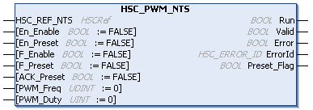

# HSC\_PWM\_NTS: Commands a Pulse Width Modulation Signal

## Function Block Description

The HSC\_PWM\_NTS function block controls the PWM (Pulse Width Modulated) output.

The function block instance name must match the name defined by configuration. Hardware related information managed by this function block is synchronized with the MAST task cycle.

[For detailed information, refer to the PWM Output Function chapter in the Modicon Edge I/O NTS Counting Modules User Guide.](../../../../../api/crossBook?lang=en-US&virtualBookName=EdgeIO_NTS_Cnt_UG&topicID=TPC_EDGEIOCountingPWMOutputFunction_E3491164)

| WARNING | |
| --- | --- |
|  | UNINTENDED OUTPUT VALUES  * Only use the function block instance in the MAST task. * Do not use the same function block instance in a different task.  Failure to follow these instructions can result in death, serious injury, or equipment damage. |

## Graphical Representation

## I/O Variables Description

This table describes the input variables:

| Inputs | Type | Comment |
| --- | --- | --- |
| HSC\_REF\_NTS | HSCRef | Reference to the HSC instance.  Must not be changed during function block execution. |
| En\_Enable | BOOL | Corresponds to OperationalCommand bit 0. For further information, refer to the [Enable Function in the Modicon Edge I/O NTS, Counting Modules, User Guide](../../../../../api/crossBook?lang=en-US&virtualBookName=EdgeIO_NTS_Cnt_UG&topicID=EnableFunction_284A99B2).  TRUE authorizes enabling of the Pulse Width Modulation (PWM) using the Enable input. |
| En\_Preset | BOOL | Corresponds to OperationalCommand bit 1. For further information, refer to the [Preset Function in the Modicon Edge I/O NTS, Counting Modules, User Guide](../../../../../api/crossBook?lang=en-US&virtualBookName=EdgeIO_NTS_Cnt_UG&topicID=EnableFunction_284A99B2).  TRUE authorizes PWM output synchronization and start using the input defined in the SyncInputLocation  parameter. |
| F\_Enable | BOOL | Corresponds to OperationalCommand bit 7. For further information, refer to the [Enable Function in theModicon Edge I/O NTS, Counting Modules, User Guide](../../../../../api/crossBook?lang=en-US&virtualBookName=EdgeIO_NTS_Cnt_UG&topicID=EnableFunction_284A99B2).  TRUE activates the PWMOutputLocation output. |
| F\_Preset | BOOL | Corresponds to OperationalCommand bit 8. For further information, refer to the [Preset Function in the Modicon Edge I/O NTS, Counting Modules, User Guide](../../../../../api/crossBook?lang=en-US&virtualBookName=EdgeIO_NTS_Cnt_UG&topicID=EnableFunction_284A99B2).  When a rising edge is detected, the PWMOutputLocation output function synchronization is authorized. |
| ACK\_Preset | BOOL | Corresponds to OperationalCommand bit 11.  When a rising edge is detected, the Preset\_Flag is reset. |
| PWM\_Freq | UDINT | Frequency of the PWM output.  Value range: 0...2000000 (20 kHz)  For example, `123456` means 1234.56 Hz. |
| PWM\_Duty | UINT | Duty cycle of the PWM output.  Value range: 0...1000 (100 %)  For example, `123` means 12.3 %. |

This table describes the output variables:

| Outputs | Type | Comment |
| --- | --- | --- |
| Run | BOOL | Corresponds to OperationalState bit 0.  TRUE indicates that the PWMOutputLocation output is activated. |
| Valid | BOOL | Corresponds to OperationalState bit 1.  TRUE indicates that the PWMOutputLocation output is valid. Frequency and duty values are within the allowed range. |
| Error | BOOL | TRUE indicates that an error is detected. Function block execution is finished.  For further information, refer to [General Information](InfoFBMan-56A3073B.html). |
| ErrorId | [HSC\_ERROR\_NTS](HSC_ERROR_NTS-3A48D241.html) | Indicates the identification number of the detected error when Error is TRUE.  For further information, refer to [General Information](InfoFBMan-56A3073B.html). |
| Preset\_Flag | BOOL | Corresponds to OperationalState bit 3.  Set to TRUE when you synchronize the PWMOutputLocation output. |

EIO000005480.01