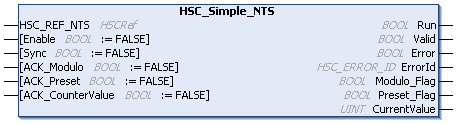

# HSC\_Simple\_NTS: Controls a Simple Type Counter

## Function Block Description

The HSC\_Simple\_NTS function block controls a Simple Counting counter with the following operating modes:

* One-shot counting
* Modulo-loop counting

The HSC\_Simple\_NTS function block is mandatory when using a Simple Counting counter.

[For detailed information, refer to the Simple Counting Function chapter in the Modicon Edge I/O NTS Counting Modules User Guide.](../../../../../api/crossBook?lang=en-US&virtualBookName=EdgeIO_NTS_Cnt_UG&topicID=SimpleCountingFunction_E04B30F0)

The function block instance name must match the name defined by configuration. Hardware related information managed by this function block is synchronized with the MAST task cycle.

| WARNING | |
| --- | --- |
|  | UNINTENDED OUTPUT VALUES  * Only use the function block instance in the MAST task. * Do not use the same function block instance in a different task.  Failure to follow these instructions can result in death, serious injury, or equipment damage. |

NOTE: Forcing the logical output values of the function block is allowed by EcoStruxure Machine Expert but it will have no impact on physical outputs if the function is active (executing).

## Graphical Representation

## I/O Variables Description

This table describes the input variables:

| Inputs | Type | Comment |
| --- | --- | --- |
| HSC\_REF\_NTS | HSCRef | Reference to the HSC instance. |
| Enable | BOOL | Corresponds to OperationalCommand bit 0.  TRUE activates the counter and takes into account pulses on the counter input. |
| Sync | BOOL | Corresponds to OperationalCommand bit 1.  One-shot counter: When a rising edge is detected, loads the preset of the counter.  Modulo-loop counter: When a rising edge is detected, resets and initializes the counter. |
| ACK\_Modulo | BOOL | Corresponds to OperationalCommand bit 2.  Modulo-loop mode: When a rising edge is detected, resets the modulo flag Modulo\_Flag. |
| ACK\_Preset | BOOL | Corresponds to OperationalCommand bit 3.  When a rising edge is detected, resets the Preset\_Flag. |
| ACK\_CounterValue | BOOL | Corresponds to OperationalCommand bit 4.  When a rising edge is detected, resets the present counter value to 0. |

This table describes the output variables:

| Outputs | Type | Comment |
| --- | --- | --- |
| Run | BOOL | Corresponds to OperationalState bit 0.  TRUE indicates that the counter is activated.  In One-shot mode, switches to 0 when CurrentValue reaches 0. A rising edge on Sync is needed to restart the counter.  In Modulo-loop mode, TRUE indicates that the counter is activated. |
| Valid | BOOL | Corresponds to OperationalState bit 1.  TRUE indicates that the output values on the function block are valid. |
| Error | BOOL | TRUE indicates that an error is detected. Function block execution is finished.  For further information, refer to [General Information](InfoFBMan-56A3073B.html). |
| ErrorId | [HSC\_ERROR\_NTS](HSC_ERROR_NTS-3A48D241.html) | Indicates the identification number of the detected error when Error is TRUE.  For further information, refer to [General Information](InfoFBMan-56A3073B.html). |
| Modulo\_Flag | BOOL | Corresponds to OperationalState bit 2.  Modulo-loop mode: Set to TRUE when the counter exceeds the modulo value. |
| Preset\_Flag | BOOL | Corresponds to OperationalState bit 3.  Set to TRUE when you synchronize the counter value.   * In one-shot mode: preset the counter value. * In modulo-loop mode: reset the counter value. |
| CurrentValue | UINT | The value of the counter.  Value range: 0...65,535 |

EIO000005480.01