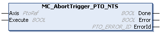

# MC\_AbortTrigger\_PTO\_NTS: Aborts Function Blocks

## Function Block Description

The MC\_AbortTrigger\_PTO\_NTS function block aborts the [MC\_TouchProbe\_PTO\_NTS](../../../../../api/crossBook?lang=en-US&virtualBookName=MCTouchProbe173C0CE3.html) function block as it executes the [AbortTrigger administrative command.](../../EdgeIO_NTS_Exp_UG&topicID=AdministrativeCommands_9598BEAE)

## Graphical Representation

## I/O Variable Description

This table describes the input variables:

| Input | Data type | Description |
| --- | --- | --- |
| Axis | PtoRef | Reference to the name of the axis (instance) for which the function block is to be executed. In the Devices tree, the name is declared in the controller configuration. |
| Execute | BOOL | When a rising edge is detected, the function block starts execution.  When a falling edge is detected, the function block stops execution and the outputs are reset. |

This table describes the output variables:

| Output | Data type | Description |
| --- | --- | --- |
| Done | BOOL | TRUE indicates that the function block execution is finished with no error detected.  The excecution of the administrative command is done. |
| Error | BOOL | TRUE indicates that an error is detected. Function block execution is finished. |
| ErrorId | [PTO\_ERROR\_ID](PTO_ERRORID-91F1AFCB.html) | Indicates the identification number of the detected error when Error is TRUE. |

EIO000005480.01