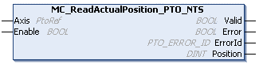

# MC\_ReadActualPosition\_PTO\_NTS: Retrieves Position of the Axis

## Function Block Description

The MC\_ReadActualPosition\_PTO\_NTS function block returns the present position of the axis.

## Graphical Representation

## I/O Variable Description

This table describes the input variables:

| Input | Data type | Description |
| --- | --- | --- |
| Axis | PtoRef | Reference to the name of the axis (instance) for which the function block is to be executed. In the Devices tree, the name is declared in the controller configuration. |
| Enable | BOOL | When TRUE, the function block is executed. The position values of the axis are continuously retrieved.  When FALSE, function block execution is terminated and the outputs are reset. |

This table describes the output variables:

| Output | Data type | Description |
| --- | --- | --- |
| Valid | BOOL | TRUE indicates that valid data is available at the function block output pin. |
| Error | BOOL | TRUE indicates that an error is detected. Function block execution is finished. |
| ErrorId | [PTO\_ERROR\_ID](PTO_ERRORID-91F1AFCB.html) | Indicates the identification number of the detected error when Error is TRUE. |
| Position | DINT | Present position of the axis (in number of pulses). |

EIO000005480.01