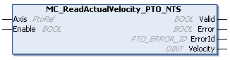

# MC\_ReadActualVelocity\_PTO\_NTS: Retrieves Velocity of the Axis

## Function Block Description

The MC\_ReadActualVelocity\_PTO\_NTS function block returns the value of the commanded velocity of the axis.

## Graphical Representation

## I/O Variable Description

This table describes the input variables:

| Input | Data type | Description |
| --- | --- | --- |
| Axis | PtoRef | Reference to the name of the axis (instance) for which the function block is to be executed. In the Devices tree, the name is declared in the controller configuration. |
| Enable | BOOL | When TRUE, the function block is executed. The velocity values of the axis are continuously retrieved.  When FALSE, terminates the function block execution and resets its outputs. |

This table describes the output variables:

| Output | Data type | Description |
| --- | --- | --- |
| Valid | BOOL | TRUE indicates that valid data is available at the function block output pin. |
| Error | BOOL | TRUE indicates that an error is detected. Function block execution is finished. |
| ErrorId | [PTO\_ERROR\_ID](PTO_ERRORID-91F1AFCB.html) | Indicates the identification number of the detected error when Error is TRUE. |
| Velocity | DINT | Present velocity of the axis (in Hz). |

EIO000005480.01