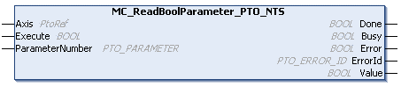

# MC\_ReadBoolParameter\_PTO\_NTS: Retrieves BOOL Parameters from PTO

## Function Block Description

The MC\_ReadBoolParameter\_PTO\_NTS function block retrieves the value of a Boolean parameter.

## Graphical Representation

## I/O Variable Description

This table describes the input variables:

| Input | Data type | Description |
| --- | --- | --- |
| Axis | PtoRef | Reference to the name of the axis (instance) for which the function block is to be executed. In the Devices tree, the name is declared in the controller configuration. |
| Execute | BOOL | When a rising edge is detected, the function block starts execution.  When a falling edge is detected, the function block stops execution and the outputs are reset. |
| ParameterNumber | [PTO\_PARAMETER](PTO_PARAMETER-92010734.html) | Parameter name or parameter number of the parameter requested from [PTO\_PARAMETER](PTO_PARAMETER-92010734.html). |

This table describes the output variables:

| Output | Data type | Description |
| --- | --- | --- |
| Done | BOOL | TRUE indicates that valid data is available at the function block output pin. |
| Busy | BOOL | TRUE indicates that the function block is busy processing data. |
| Error | BOOL | TRUE indicates that an error is detected. Function block execution is finished. |
| ErrorId | [PTO\_ERROR\_ID](PTO_ERRORID-91F1AFCB.html) | Indicates the identification number of the detected error when Error is TRUE. |
| Value | BOOL | Value of the requested Boolean parameter. |

EIO000005480.01