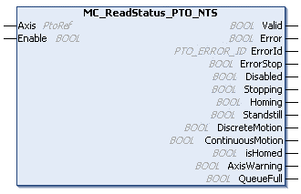

# MC\_ReadStatus\_PTO\_NTS: Retrieves the State of the Axis

## Function Block Description

The MC\_ReadStatus\_PTO\_NTS function block retrieves the [state diagram](PTOOpModes-97FFD489.html#PTOOpModes-97FFD489__MotionStateDiagram-9800DF9E) status of the axis.

## Graphical Representation

## I/O Variable Description

This table describes the input variables:

| Input | Data type | Description |
| --- | --- | --- |
| Axis | PtoRef | Reference to the name of the axis (instance) for which the function block is to be executed. In the Devices tree, the name is declared in the controller configuration. |
| Enable | BOOL | When TRUE, information on the [state diagram](PTOOpModes-97FFD489.html#PTOOpModes-97FFD489__MotionStateDiagram-9800DF9E) status of the axis are continuously retrieved.  When FALSE, terminates the function block execution and resets its outputs. |

This table describes the output variables:

| Output | Data type | Description |
| --- | --- | --- |
| Valid | BOOL | TRUE indicates that valid data is available at the function block output pin. |
| Error | BOOL | TRUE indicates that an error is detected. Function block execution is finished. |
| ErrorId | [PTO\_ERROR\_ID](PTO_ERRORID-91F1AFCB.html) | Indicates the identification number of the detected error when Error is TRUE. |
| ErrorStop | BOOL | The ErrorStop state is assigned the highest priority. It is applicable if an error is detected on the axis or in the controller. The ErrorStop state is maintained as long as the Error is TRUE. No motion command is accepted until a reset is performed using the function block [MC\_Reset\_PTO\_NTS](MCReset-1739AB2D.html). |
| Disabled | BOOL | The Disabled state is the initial state of the axis. No motion command is allowed. The axis is not homed. |
| Stopping | BOOL | The Stopping state is applicable when the axis is controlled by the function block [MC\_Stop\_PTO\_NTS](MCStopPTONTS-19DF86D4.html). |
| Homing | BOOL | The Homing state is applicable when the axis is controlled by the function block [MC\_Home\_PTO\_NTS](MCHomePTONTS-19720644.html). |
| Standstill | BOOL | The Standstill state is the initial state of the axis. No error is detected. No motion commands are executed on the axis. |
| DiscreteMotion | BOOL | The DiscreteMotion state is applicable when the axis is controlled by one of the function blocks:   * [MC\_Halt\_PTO\_NTS](MCHALTPTONTS-196F93B4.html) * [MC\_MoveAbsolute\_PTO\_NTS](MCMoveAbsolutePTONTS-1979395D.html) * [MC\_MoveRelative\_PTO\_NTS](MCMoveRelativePTONTSC-197B6089.html) |
| ContinuousMotion | BOOL | The ContinuousMotion state is applicable when the axis is controlled by the function block [MC\_MoveVelocity\_PTO\_NTS](MCMoveVelocityPTONTS-19D339BA.html). |
| IsHomed | BOOL | When TRUE, the reference point is valid. Absolute motion is allowed. |
| AxisWarning | BOOL | When TRUE, an error is detected on the axis (refer to [MC\_ReadAxisError\_PTO\_NTS](MCReadAxisError-16435DAA.html) for further information). |
| QueueFull | BOOL | When TRUE, the motion queue is full. No additional buffered motion is allowed. |

EIO000005480.01