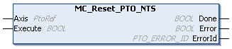

# MC\_Reset\_PTO\_NTS: Resets Axis-Related Errors

## Function Block Description

The MC\_Reset\_PTO\_NTS function block resets the detected axis-related errors. If conditions are permitting, it allows a transition from the ErrorStop state to Standstill. It updates the AxisState. If the function block is executed when there is no detected error, it does not affect motion commands that are in progress.

The MC\_Reset\_PTO\_NTS function block executes the [Reset administrative command.](../../../../../api/crossBook?lang=en-US&virtualBookName=EdgeIO_NTS_Exp_UG&topicID=AdministrativeCommands_9598BEAE)

## Graphical Representation

## I/O Variable Description

This table describes the input variables:

| Input | Data type | Description |
| --- | --- | --- |
| Axis | PtoRef | Reference to the name of the axis (instance) for which the function block is to be executed. In the Devices tree, the name is declared in the controller configuration. |
| Execute | BOOL | When a rising edge is detected, the function block starts execution.  When a falling edge is detected, the function block stops execution and the outputs are reset. |

This table describes the output variables:

| Output | Data type | Description |
| --- | --- | --- |
| Done | BOOL | TRUE indicates that the reset is finished. Function block execution is finished. |
| Error | BOOL | TRUE indicates that an error is detected. Function block execution is finished. |
| ErrorId | [PTO\_ERROR\_ID](PTO_ERRORID-91F1AFCB.html) | Indicates the identification number of the detected error when Error is TRUE. |

EIO000005480.01