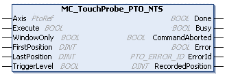

# MC\_TouchProbe\_PTO\_NTS: Activates a Trigger Event

## Function Block Description

The MC\_TouchProbe\_PTO\_NTS function block is used to activate a trigger event on the probe input. This trigger event allows to record the axis position, and/or to start a buffered move.

The MC\_TouchProbe\_PTO\_NTS function block executes the [TouchProbe administrative command.](../../../../../api/crossBook?lang=en-US&virtualBookName=EdgeIO_NTS_Exp_UG&topicID=AdministrativeCommands_9598BEAE)

## Graphical Representation

## I/O Variable Description

This table describes the input variables:

| Input | Data type | Description |
| --- | --- | --- |
| Axis | PtoRef | Reference to the name of the axis (instance) for which the function block is to be executed. In the Devices tree, the name is declared in the controller configuration. |
| Execute | BOOL | When a rising edge is detected, the function block starts execution. |
| WindowOnly | BOOL | When TRUE, trigger events are only accepted in the range configured with the inputs FirstPosition and LastPosition. |
| FirstPosition | DINT | The start position of the range in which trigger events are accepted. |
| LastPosition | DINT | The end position of the range in which trigger events are accepted. |
| TriggerLevel | BOOL | When FALSE, the trigger event occurs on a falling edge of the PROBE input.  When TRUE, the trigger event occurs on a rising edge of the PROBE input.  Default value: FALSE |

This table describes the output variables:

| Output | Data type | Description |
| --- | --- | --- |
| Done | BOOL | TRUE indicates that the trigger event on the PROBE input is detected and the TouchProbe function block is finished.  When a rising edge is detected, the output RecordedPosition is updated, and the motion command, sent with the [seTrigger buffer mode](MC_BUFFERMODE-91D8C3A7.html), is executed. |
| Busy | BOOL | TRUE indicates that the function block is active and waiting for the trigger event on the PROBE input to be detected. |
| CommandAborted | BOOL | When TRUE, the function block execution is aborted by the function block [MC\_AbortTrigger\_PTO\_NTS](MCAbortTriggerPTONTS-163CCF2B.html) or by a detected error. The TouchProbe execution is finished. |
| Error | BOOL | TRUE indicates that an error is detected. Function block execution is finished. |
| ErrorId | [PTO\_ERROR\_ID](PTO_ERRORID-91F1AFCB.html) | Indicates the identification number of the detected error when Error is TRUE. |
| RecordedPosition | DINT | The position where the trigger event is detected. |

NOTE: Once the function block is enabled by the Execute input, the Busy output is TRUE and remains TRUE until the first valid event. At that point, the Busy output is set to FALSE and the Done output is set to TRUE and remains so until another rising edge is detected at the Execute input. Subsequent events are ignored until the function block is re-enabled.

EIO000005480.01