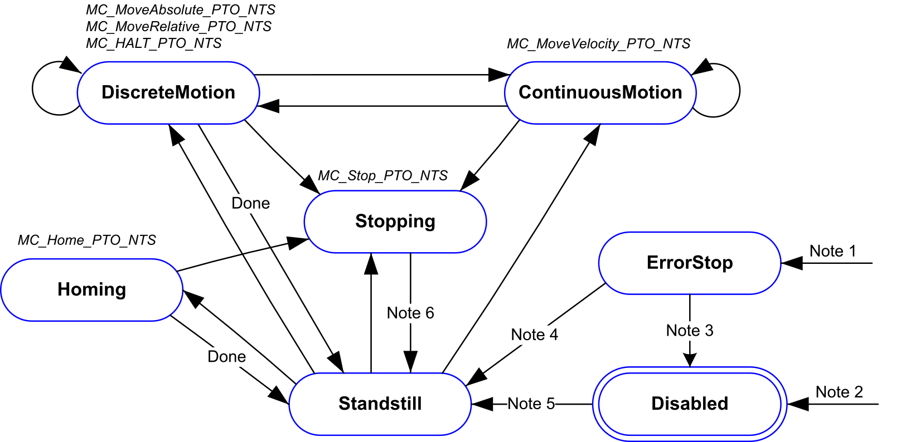

# Operating Modes

## Motion State Diagram

The axis is in one of the states defined in this diagram:

**Note 1** From any state, when an error is detected.

**Note 2** From any state except ErrorStop, when MC\_Power\_PTO\_NTS.Status equals FALSE.

**Note 3** MC\_Reset\_PTO.Done equals TRUE and MC\_Power\_PTO\_NTS.Status equals FALSE.

**Note 4** MC\_Reset\_PTO.Done equals TRUE and MC\_Power\_PTO\_NTS.Status equals TRUE.

**Note 5** MC\_Power\_PTO\_NTS.Status equals TRUE.

**Note 6** MC\_Stop\_PTO.Done equals TRUE and MC\_Stop\_PTO.Execute equals FALSE.

The table describes the axis states:

| State | Description |
| --- | --- |
| **Disabled** | Initial state of the axis, no motion command is allowed.  The axis is not homed. |
| **Standstill** | Power is on, there is no error detected, and there are no motion commands active on the axis.  A motion command is allowed. |
| **ErrorStop** | Highest priority, applicable when an error is detected on the axis or in the controller.  Ongoing motion is aborted by an implicit stop command using the Fast Stop Deceleration parameter value defined in the configuration. [For further information, refer to *PTO Configuration*.](../../../../../api/crossBook?lang=en-US&virtualBookName=EdgeIO_NTS_Exp_UG&topicID=PTOInterfaceConfiguration_827F6FBC) The Error output is set to TRUE on applicable function blocks, and the ErrorId output indicates the identification number of the detected error. No further motion command is accepted until a reset has been performed using MC\_Reset\_PTO\_NTS. |
| **Homing** | Applicable when MC\_Home\_PTO\_NTS controls the axis. |
| **DiscreteMotion** | Applicable when MC\_MoveRelative\_PTO\_NTS, MC\_MoveAbsolute\_PTO\_NTS, or MC\_Halt\_PTO\_NTS controls the axis. |
| **ContinuousMotion** | Applicable when MC\_MoveVelocity\_PTO\_NTS controls the axis. |
| **Stopping** | Applicable when MC\_Stop\_PTO\_NTS controls the axis. |

NOTE: Function blocks that are not listed in the state diagram do not affect a change of state of the axis.

[For further information on the axis state, refer to *Driven\_Operational*.](../../../../../api/crossBook?lang=en-US&virtualBookName=EdgeIO_NTS_Exp_UG&topicID=Driven_Operational_93EEBFFF)

## Motion Command Abort Table

A new motion command can abort an ongoing motion command as indicated in the following table:

| Motion Command | | New | | | | | |
| --- | --- | --- | --- | --- | --- | --- | --- |
| Home | Velocity | Relative | Absolute | Halt | Stop |
| **Ongoing** | Home | – | – | – | – | – | ✓ |
| Velocity | – | ✓ | ✓ | ✓ | ✓ | ✓ |
| Relative | – | ✓ | ✓ | ✓ | ✓ | ✓ |
| Absolute | – | ✓ | ✓ | ✓ | ✓ | ✓ |
| Halt | – | ✓ | ✓ | ✓ | ✓ | ✓ |
| Stop | – | – | – | – | – | – |
| **✓** The ongoing motion command is aborted and the new motion command begins execution in accordance with the BufferMode parameter value. [For further information, refer to *BufferMode Parameter Description*.](../../../../../api/crossBook?lang=en-US&virtualBookName=EdgeIO_NTS_Exp_UG&topicID=BufferModeDescription_7BCA9A92)  **–** The new motion command is rejected and results in a detected error. | | | | | | | |

EIO000005480.01