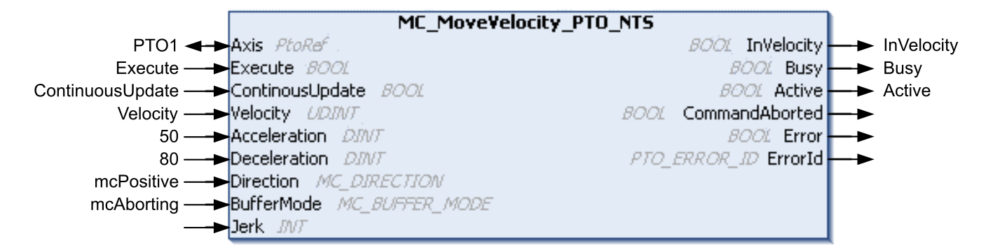
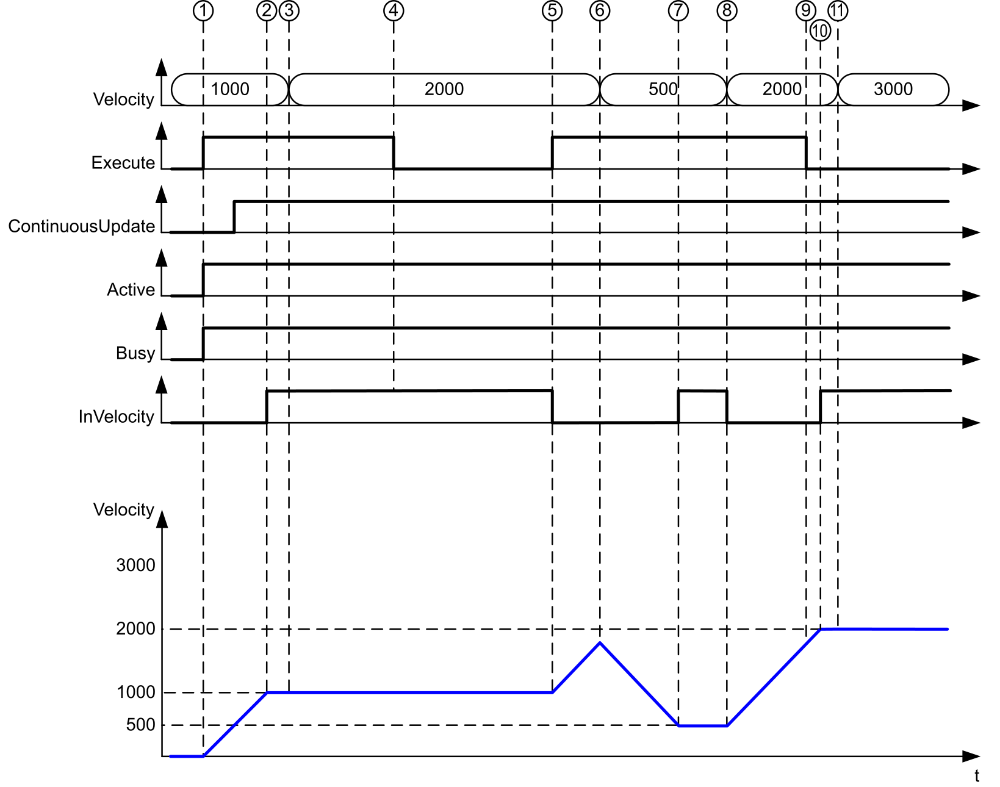
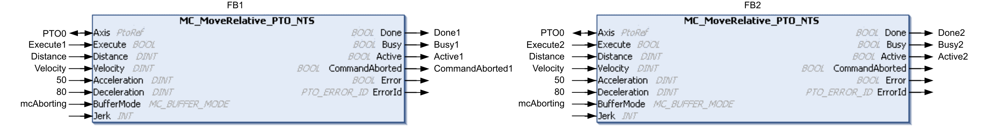
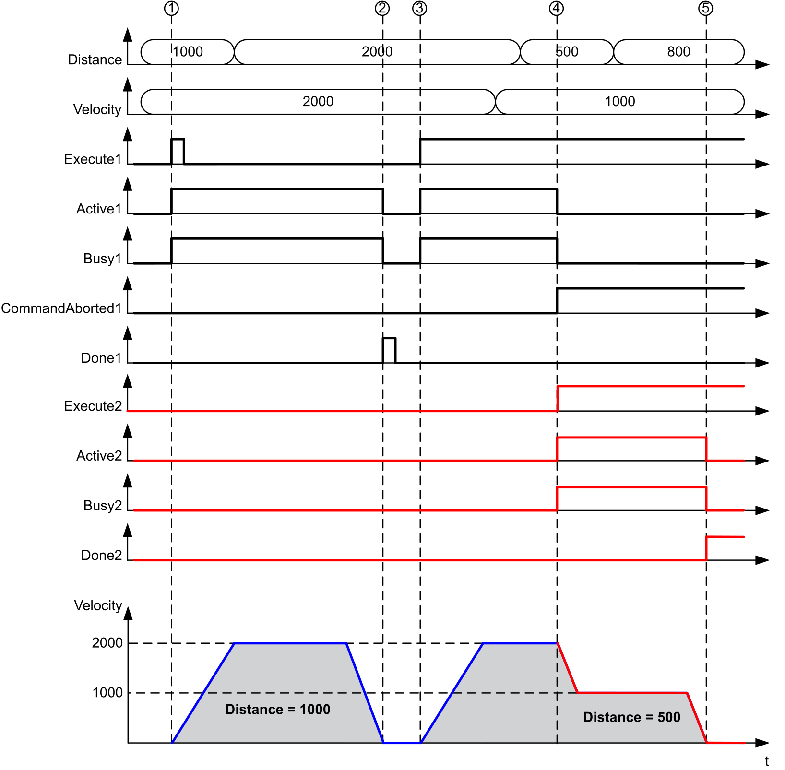
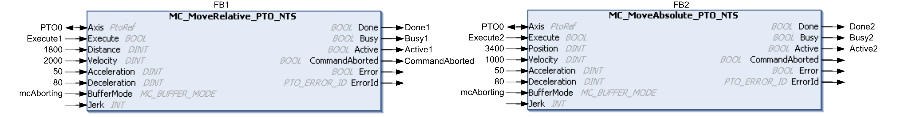
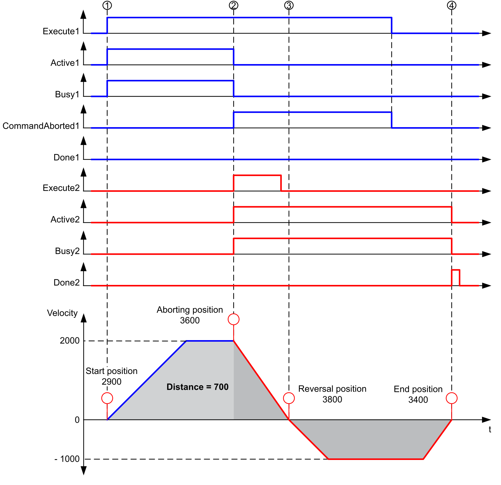
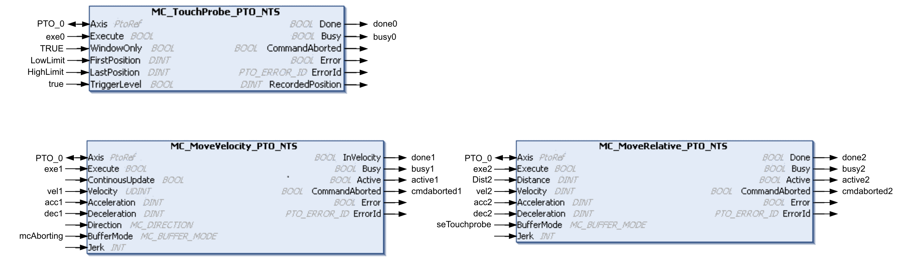
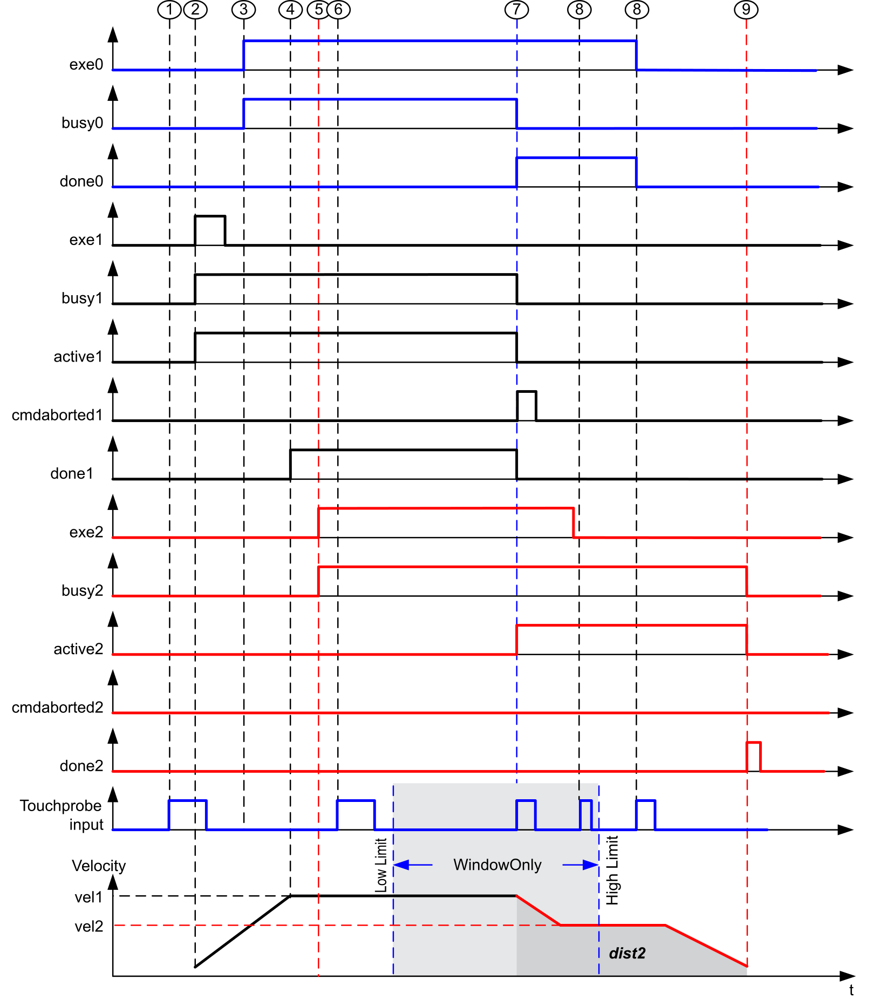

# Timing Diagram Examples

## Move Velocity to Move Velocity with mcAborting

 

**1** Execute rising edge: command parameters are latched, movement is started with target velocity 1000.

**2** Target velocity 1000 is reached.

**3** Velocity parameter is changed to 2000: not applied at this point (no rising edge on Execute input, and ContinuousUpdate was latched with value 0 at the start of the movement).

**4** Execute falling edge: status bits are maintained (movement is still active).

**5** Execute rising edge: command parameters are latched, movement is started with target velocity 2000 and ContinuousUpdate active.

**6** Velocity parameter is changed to 500: applied (ContinuousUpdate is TRUE). The previous target velocity 2000 was not reached.

**7** Target velocity 500 is reached.

**8** Velocity parameter is changed to 2000: applied (ContinuousUpdate is TRUE).

**9** Execute falling edge: status bits are maintained (movement is still active).

**10** Target velocity 2000 is reached, InVelocity is set (Execute pin is FALSE).

**11** Velocity parameter is changed to 3000: not applied (movement is still active).

## Move Relative to Move Relative with mcAborting

 

**1** FB1 Execute rising edge: command parameters are latched, movement is started with target velocity 2000 and distance 1000.

**2** Movement ends: distance traveled is 1000.

**3** FB1 Execute rising edge: command parameters are latched, movement is started with target velocity 2000 and distance 2000.

**4** FB2 Execute rising edge: command parameters are latched, movement is started with target velocity 1000 and distance 500.

NOTE: FB1 is aborted.

**5** Movement ends.

## Move Relative to Move Absolute with mcAborting

 

**1** FB1 Execute rising edge: command parameters are latched, movement is started with target velocity 2000 and distance 1800.

**2** FB2 Execute rising edge: command parameters are latched, FB1 is aborted, and movement continues with target velocity 1000 and target position 3400. Automatic direction management: direction reversal is needed to reach target position, move to stop at deceleration of FB2.

**3** Velocity 0, direction reversal, movement resumes with target velocity 1000 and target position 3400.

**4** Movement ends: target position 3400 is reached.

## Move Velocity to Move Relative with seTrigger

 

**1** MC\_TouchProbe\_PTO\_NTS not busy at this point even if the probe input is active, but is not monitored because the Busy signal busy0 is not active.

**2** MC\_MoveVelocity\_PTO\_NTS Execute rising edge: command parameters are latched, movement is started with target velocity vel1.

**3** MC\_TouchProbe\_PTO\_NTS Execute rising edge: The MC\_TouchProbe\_PTO\_NTS function block is active, monitoring for a trigger event in the specified window.

**4** vel1 is reached.

**5** MC\_MoveRelative\_PTO\_NTS Execute rising edge: command parameters are latched, waiting for probe event to start.

**6** Probe event outside of enable window: event is ignored.

**7** A valid event is detected. MC\_MoveRelative\_PTO\_NTS aborts MC\_MoveVelocity\_PTO\_NTS. The MC\_TouchProbe\_PTO\_NTS function block is done, the monitoring for a trigger event is stopped.

**8** Subsequent events are ignored.

**9** Movement ends.

EIO000005480.01