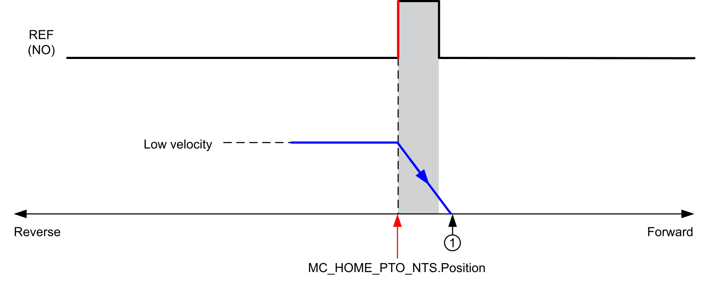

# Homing Modes

## Description

Homing is the method to establish the reference point or origin for absolute movement.

A homing movement is performed using the following homing movement types:

* [Position Setting](PositionSetting-C6826FC4.html)
* [Long Reference](LongReference-C682D61C.html),
* [Long Reference & Index](LongRefandIndex-C6831E6F.html),
* [Short Reference Reversal](ShortRefReversal-C6836E02.html),
* [Short Reference No Reversal](ShortRefNoRev-C683B447.html),
* [Short Reference & Index Outside](ShortRefIndexOut-C68403F5.html),
* [Short Reference & Index Inside](ShortRefIndexIn-C6844ED6.html).

A homing movement must be completed without interruption for the new reference point to be valid. If the reference movement is interrupted, it needs to be started again.

Also refer to [MC\_Home\_PTO\_NTS](MCHomePTONTS-19720644.html) and [PTO\_HOMING\_MODE](PTO_HOMING-91FFA9DE.html).

## Home Position

Homing is done with an external switch (REF input), and the homing position is defined on the switch edge. Then the motion is decelerated until stopped.

The position of the axis at the end of the motion sequence may therefore differ from the position parameter set on the function block:

**REF (NO)** Reference point (Normally Open)

**1** Position at the end of motion = MC\_HOME\_PTO\_NTS.Position + “deceleration to stop” distance.

To simplify the representation of a stop in the homing mode diagrams, the following presentation is made to represent the position of the axis:

**REF (NO)**: REF input (Normally Open)

EIO000005480.01