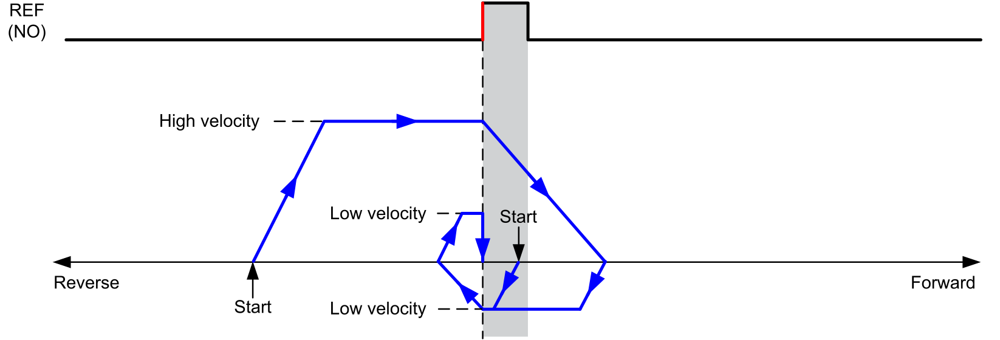
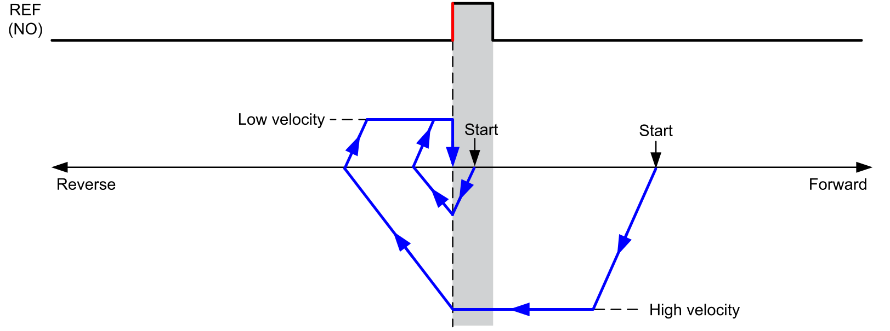
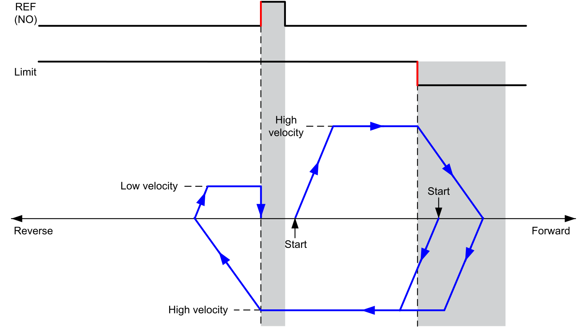
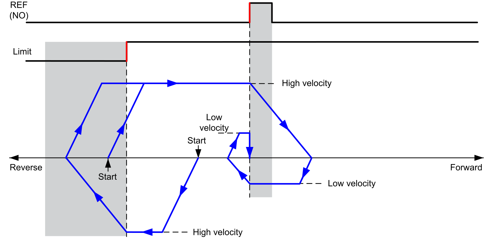

# Short Reference Reversal

The homing profile depends on the REF input signal:

**REF (NO)** Reference point (Normally Open)

  

If limits (hardware or software) are configured, the movement reverses to continue searching for the REF input signal:

**REF (NO)**: REF input (Normally Open)

EIO000005480.01