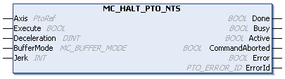
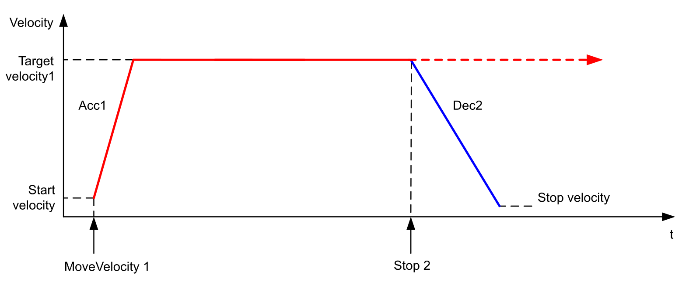
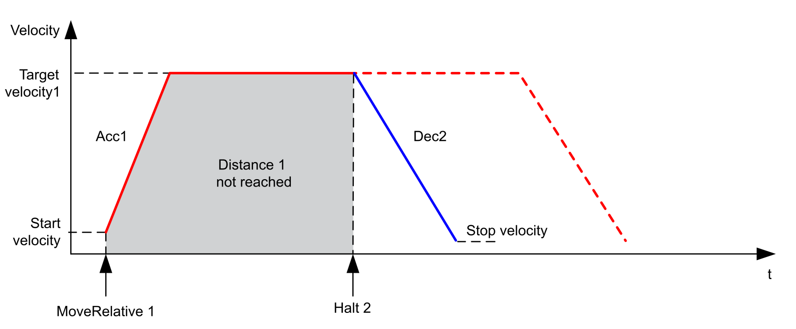

# MC\_HALT\_PTO\_NTS: Commands a Controlled Motion Stop until the Velocity equals Zero

## Function Block Description

The MC\_HALT\_PTO\_NTS function block commands a controlled motion stop and the axis is set to the state DiscreteMotion until the velocity is zero. With the Done output set to TRUE, the state is set to Standstill.

The MC\_HALT\_PTO\_NTS function block executes the [Halt motion command.](../../../../../api/crossBook?lang=en-US&virtualBookName=EdgeIO_NTS_Exp_UG&topicID=MotionCommandHalt_978B4568)

## Graphical Representation

## I/O Variable Description

This table describes the input variables:

| Input | Data type | Description |
| --- | --- | --- |
| Axis | PtoRef | Reference to the name of the axis (instance) for which the function block is to be executed. In the Devices tree, the name is declared in the controller configuration. |
| Execute | BOOL | When a rising edge is detected, the function block sends the motion command.  When a falling edge is detected, the outputs of the function block are reset.  When Execute is TRUE, the outputs of the function block are updated.  When Execute is FALSE, the outputs of the function block are not updated.  NOTE: Setting Execute to FALSE does not cancel the motion command sent on a rising edge. |
| Deceleration | DINT | Deceleration in Hz/ms or in ms (according to the configuration).  Value range (Hz/ms): 1...[Maximum Deceleration](../../../../../api/crossBook?lang=en-US&virtualBookName=EdgeIO_NTS_Exp_UG&topicID=PTOInterfaceConfiguration_827F6FBC)  Value range (ms): Maximum Deceleration...400,000  Default value: 0  NOTE: The default value of ZERO will cause the function block to detect an error, thereby requiring you to set an appropriate value for the parameter. |
| BufferMode | [MC\_BUFFER\_MODE](MC_BUFFERMODE-91D8C3A7.html) | When TRUE, transition is performed from an ongoing motion. Refer to [MC\_BUFFER\_MODE](MC_BUFFERMODE-91D8C3A7.html). |
| Jerk | INT | Sets the percentage used to create an S-curve profile.  Value range: 0...65,535\*  Default value: 0  \*If the provided value is above 100, the Jerk is set to 100 and an advisory is issued.  If the Jerk parameter is set to 100%, then the acceleration and deceleration values are double the value defined in the acceleration and deceleration parameters.  For example, if Jerk is set to 100%, then the acceleration and deceleration values equal to the value defined in the Acceleration and Deceleration parameters multiplied by 2.  The duration for the acceleration and deceleration is maintained regardless of the Jerk parameter value. To maintain this duration, the acceleration or deceleration provided to the motion command is adjusted accordingly.  NOTE: If the new calculated acceleration or deceleration exceeds the Maximum Acceleration or Maximum Deceleration parameter value, an advisory is issued and Jerk is changed to the closest possible Jerk value.  For further information about acceleration and deceleration ramps, refer to [Acceleration/Deceleration Ramp](../../../../../api/crossBook?lang=en-US&virtualBookName=EdgeIO_NTS_Exp_UG&topicID=AccelerationDecelerationRamp_96035BA2). |

This table describes the output variables:

| Output | Data type | Description |
| --- | --- | --- |
| Done | BOOL | TRUE indicates that the Halt is finished. Function block execution is finished. |
| Busy | BOOL | TRUE indicates that the function block is busy processing data. |
| Active | BOOL | When TRUE, the function block controls the motion of the axis. Only one function block at a time can control one axis. |
| CommandAborted | BOOL | When TRUE, the function block execution is cancelled due to another move command or a detected error. The motion execution is finished. |
| Error | BOOL | TRUE indicates that an error is detected. Function block execution is finished. |
| ErrorId | [PTO\_ERROR\_ID](PTO_ERRORID-91F1AFCB.html) | Indicates the identification number of the detected error when Error is TRUE. |

NOTE: The function block completes with velocity zero.

## Timing Diagram Example

The following diagram shows the profile of the motion command when axis is in ContinuousMotion state. For further information, refer to the [Motion State Diagram](PTOOpModes-97FFD489.html#PTOOpModes-97FFD489__MotionStateDiagram-9800DF9E).

The following diagram shows the profile of the motion command when axis is in DiscreteMotion state. For further information, refer to the [Motion State Diagram](PTOOpModes-97FFD489.html#PTOOpModes-97FFD489__MotionStateDiagram-9800DF9E).

NOTE: In this diagram, BufferMode of the Absolute motion command is set to mcAborting [(refer to the *PTO Configuration*)](../../../../../api/crossBook?lang=en-US&virtualBookName=EdgeIO_NTS_Exp_UG&topicID=PTOInterfaceConfiguration_827F6FBC).

EIO000005480.01