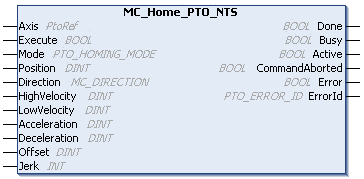

# MC\_Home\_PTO\_NTS: Commands the Axis to Move to a Reference Position

## Function Block Description

The MC\_Home\_PTO\_NTS function block commands the axis to move to the reference position, and the axis is set to the state Homing. The details of this sequence depend on the Homing mode defined. The REF Enabled input parameter and the INDEX Enabled input parameter must be defined in the Edge I/O NTS Editor of the Logic Builder. For further information, [(refer to the *PTO Configuration*)](../../../../../api/crossBook?lang=en-US&virtualBookName=EdgeIO_NTS_Exp_UG&topicID=PTOInterfaceConfiguration_827F6FBC).

The MC\_Home\_PTO\_NTS function block executes the [Homing motion command.](../../../../../api/crossBook?lang=en-US&virtualBookName=EdgeIO_NTS_Exp_UG&topicID=MotionCommandHoming_978B4779)

## Graphical Representation

## I/O Variable Description

This table describes the input variables:

| Inputs | Data type | Description |
| --- | --- | --- |
| Axis | PtoRef | Reference to the name of the axis (instance) for which the function block is to be executed. In the Devices tree, the name is declared in the controller configuration. |
| Execute | BOOL | When a rising edge is detected, the function block sends the motion command.  When a falling edge is detected, the outputs of the function block are reset.  When Execute is TRUE, the outputs of the function block are updated.  When Execute is FALSE, the outputs of the function block are not updated.  NOTE: Setting Execute to FALSE does not cancel the motion command sent on a rising edge. |
| Mode | [PTO\_HOMING\_MODE](PTO_HOMING-91FFA9DE.html) | The predefined type of homing mode. Refer to [PTO\_HOMING\_MODE](PTO_HOMING-91FFA9DE.html).  Default value: PositionSetting |
| Position | DINT | Sets the position when the origin event is detected.  Default value: 0 |
| Direction | [MC\_DIRECTION](MC_DIRECTION-91E6AB9A.html) | The starting direction that is exclusive to Homing. The values mcPositiveDirection and mcNegativeDirection are valid.  Default value: mcNegativeDirection |
| HighVelocity | DINT | The target homing velocity for searching the limit or reference switch.  Value range (in Hz): 1...[Maximum Velocity](../../../../../api/crossBook?lang=en-US&virtualBookName=EdgeIO_NTS_Exp_UG&topicID=PTOInterfaceConfiguration_827F6FBC)  Default value: 0  NOTE: The default value of ZERO will cause the function block to detect an error, thereby requiring you to set an appropriate value for the parameter. |
| LowVelocity | DINT | The target homing velocity for searching the reference switch or index signal. The motion stops when the switching point is detected.  Value range (in Hz): 1...HighVelocity  Default value: 0  NOTE: The default value of ZERO will cause the function block to detect an error, thereby requiring you to set an appropriate value for the parameter. |
| Acceleration | DINT | Acceleration in Hz/ms or in ms (according to the configuration).  Value range (in Hz/ms): 1...[Maximum Acceleration](../../../../../api/crossBook?lang=en-US&virtualBookName=EdgeIO_NTS_Exp_UG&topicID=PTOInterfaceConfiguration_827F6FBC)  Value range (in ms): [Maximum Acceleration](../../../../../api/crossBook?lang=en-US&virtualBookName=EdgeIO_NTS_Exp_UG&topicID=PTOInterfaceConfiguration_827F6FBC)...400,000  Default value: 0  NOTE: The default value of ZERO will cause the function block to detect an error, thereby requiring you to set an appropriate value for the parameter. |
| Deceleration | DINT | Deceleration in Hz/ms or in ms (according to the configuration).  Value range (Hz/ms): 1...[Maximum Deceleration](../../../../../api/crossBook?lang=en-US&virtualBookName=EdgeIO_NTS_Exp_UG&topicID=PTOInterfaceConfiguration_827F6FBC)  Value range (ms): Maximum Deceleration...400,000  Default value: 0  NOTE: The default value of ZERO will cause the function block to detect an error, thereby requiring you to set an appropriate value for the parameter. |
| Offset | DINT | Sets the number of pulses to move at the end of the Homing motion command due to mechanical reasons.  For further information, refer to [Homing Modes](HomingModesPTO-C68142CD.html).  The sign defines the direction of the move and LowVelocity is the velocity at which the move is executed. The parameter is used during a reference movement without index pulse.  NOTE: The offset movement is part of the Homing motion command and is executed 500 ms after CurrentVelocity reaches 0.  Value range: -2,147,483,648...2,147,483,647  Default value: 0 |
| Jerk | INT | Sets the percentage used to create an S-curve profile.  Value range: 0...65,535\*  Default value: 0  \*If the provided value is above 100, the Jerk is set to 100 and an advisory is issued.  If the Jerk parameter is set to 100%, then the acceleration and deceleration values are double the value defined in the acceleration and deceleration parameters.  For example, if Jerk is set to 100%, then the acceleration and deceleration values equal to the value defined in the Acceleration and Deceleration parameters multiplied by 2.  The duration for the acceleration and deceleration is maintained regardless of the Jerk parameter value. To maintain this duration, the acceleration or deceleration provided to the motion command is adjusted accordingly.  NOTE: If the new calculated acceleration or deceleration exceeds the Maximum Acceleration or Maximum Deceleration parameter value, an advisory is issued and Jerk is changed to the closest possible Jerk value.  For further information about acceleration and deceleration ramps, refer to [Acceleration/Deceleration Ramp](../../../../../api/crossBook?lang=en-US&virtualBookName=EdgeIO_NTS_Exp_UG&topicID=AccelerationDecelerationRamp_96035BA2). |

This table describes the output variables:

| Output | Data type | Description |
| --- | --- | --- |
| Done | BOOL | TRUE indicates that the homing is finished. Function block execution is finished. |
| Busy | BOOL | TRUE indicates that the function block is busy processing data. |
| Active | BOOL | When TRUE, the function block controls the motion of the axis. Only one function block at a time can control one axis. |
| CommandAborted | BOOL | When TRUE, the function block execution is cancelled due to another move command or a detected error. The execution of the motion is finished. |
| Error | BOOL | TRUE indicates that an error is detected. Function block execution is finished. |
| ErrorId | [PTO\_ERROR\_ID](PTO_ERRORID-91F1AFCB.html) | Indicates the identification number of the detected error when Error is TRUE. |

## Timing Diagram Example

For further information, refer to [Homing Modes](HomingModesPTO-C68142CD.html).

EIO000005480.01